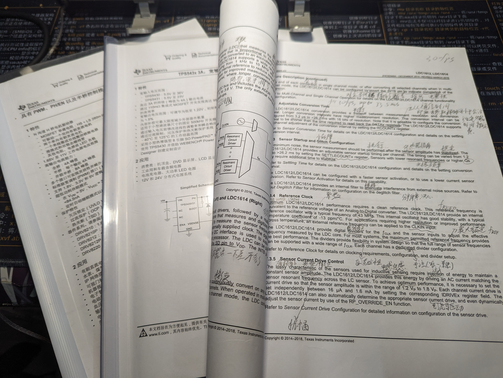
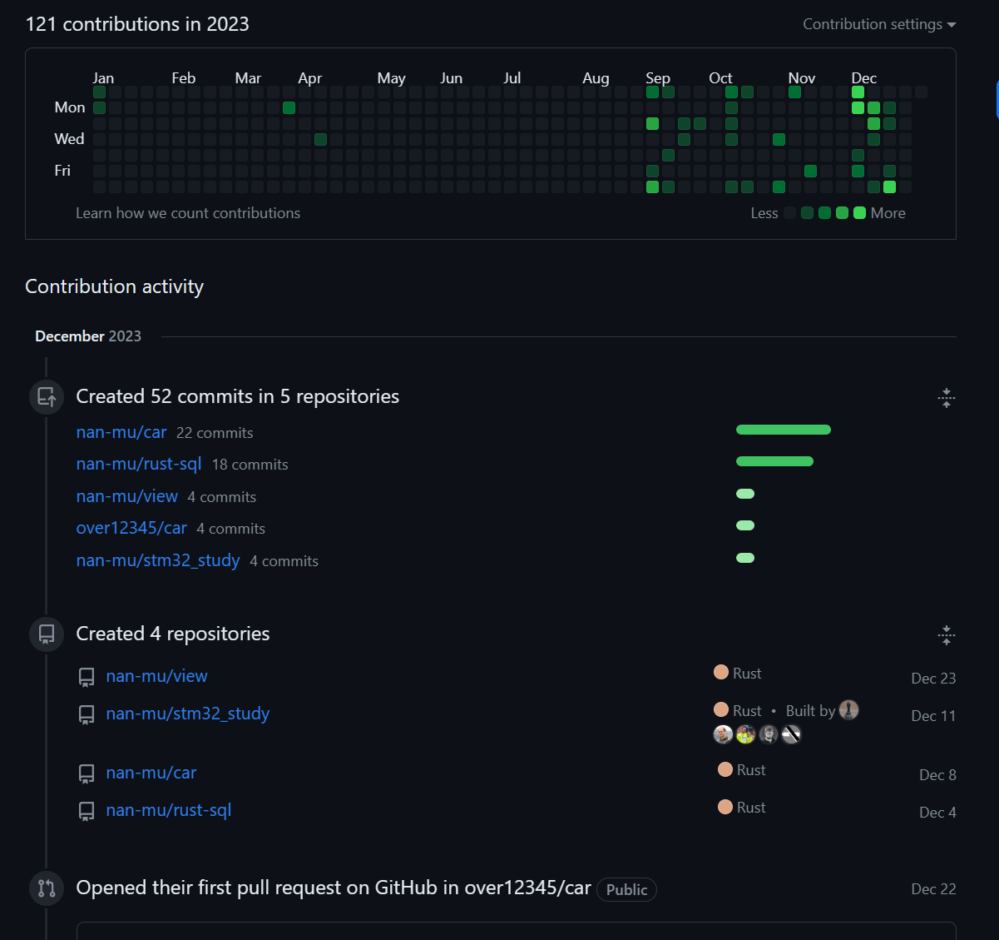
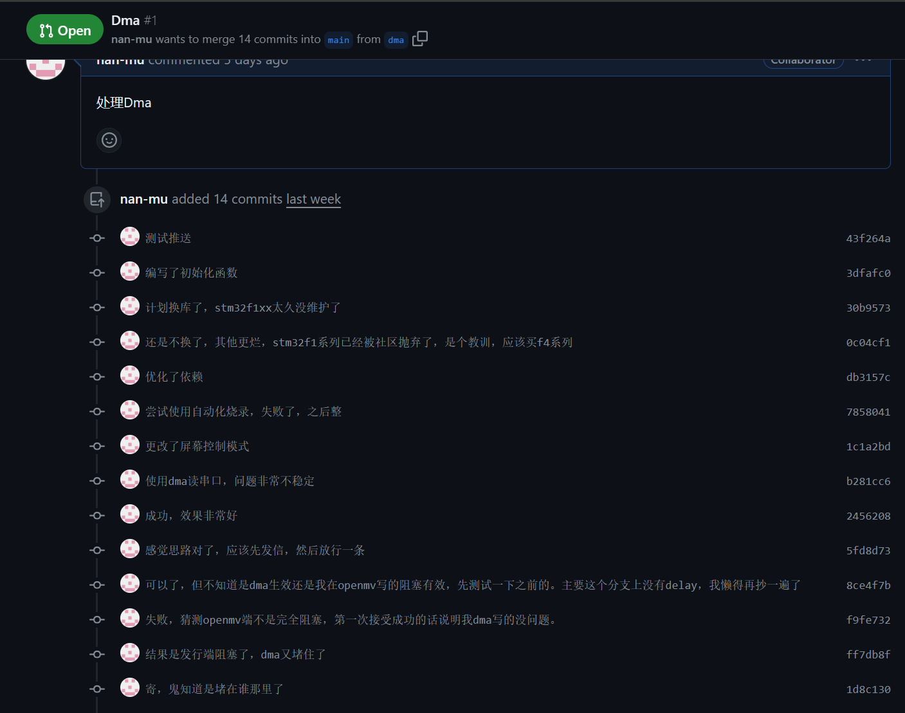

# 智能小车报告

::: warning
这是报告的第三部分，第一部分是[智能小车报告-硬件](/report/智能小车报告-硬件)
:::

## 反思

总结下来问题主要有二。一个是我们的计划，这导致我们必然会花上比起其他组来说跟多的时间。二就是时间规划。

### 能力或认知问题

#### 我们做了什么？

早在一开始，当初编写立项书时我们很希望能“**自己**”完成全部的内容。当时我们了解到其实参加比赛的队伍其实并非完全自己完成比赛，这个程度大家有所不同，但，循迹模块，金属探测模块，稳压模块，电机驱动模块都是在网上购买或者在研创会借过来的。而我们所谓的“自研”，就是尽自己所能做出来。可能其他组在淘宝花20买了一个金属探测器，但我们确实自己画了一个板子尝试自己做出来。我们从芯片开始，自行阅读TI官网的说明书，自己画PCB，自己焊接。这是我们的初期工作，问题其实很大，现在看来这部分的工作大部分可以说是沉没的，我们所有的收获只是花钱买了一次实践经验，具体技术问题见硬件部分。

图2.1 使用的三款芯片的规格书

> > 从左至右依次是电机控制芯片、稳压芯片和实现金属探测的LDC芯片，只翻开最后一本是因为其余两本的功能相对简单而且有中文，最后的LDC1612规格书只有英文且非常复杂，但我们经过了仔细的学习和研究能够初步地操控它。

在后期工作主要就是代码整合。代码部分我们也同样能保证没有使用或照搬他人的代码，因为我们使用了一门新的编程语言，rust，并且在整个开发过程当中使用版本控制系统保存我们的项目进度。网上的资料全是以C语言和Python与它们的超集编写的，无论是在中文还是外文网站上都可以找到很多可以满足并完成比赛要求的代码。在一开始我们确实计划找一些代码然后看懂它的逻辑以完善我们的小车，但最后发现没时间。真的是没有时间所以很遗憾，我们组还有一起学习的友人C同学两只队伍完全编写了代码。当然我们不可能说我们完全自研，比方友人C她们自己编写HAL库的话也不大现实。所以我们还是使用了大量开源代码。类比硬件部分我认为我们相当于买了芯片，自己画了电路。

图2.2 负责全部开发任务的我同学的github账号动态

#### 哪些部分出了问题？

 所有问题可以归咎于缺少经验，所以我想说说我们这次吸取了哪些经验。

首先是硬件部分。就像2.1.1所说我们在硬件部分所作的努力可以说全部沉没了，我们的金属探测设备没有报错但没有输出（它是一个I2C设备，具体细节见3.1）。我们的电机驱动没问题但我把电机驱动和电压模块画在一块板子上，然后电压模块出问题了。我们总共就画了两块板子，我们需要阅读英文的规格书，我们需要自己学会画能打板的PCB，这都需要时间。我相信给我们时间我们会完成的，所以问题其实是错估了我们面对一个未知领域的熟悉时间，和忽略了一些比较重要的点。

> 另一个问题在我，就是负责所有工作的我，也是本报告的作者。按照学长的话来说我会的东西非常多，大多是我从初高中开始对软件的自行摸索，这为我在大学中的很多活动积攒了很多“老本”，比方说我熟悉工程上的C语言开发 [nan-mu/ConsoleGame (github.com)](https://github.com/nan-mu/ConsoleGame)，大一时验收C语言大作业使用了很多超前的技术，老师和学长当时确实表示他们看不懂我写的东西（lambda表达式和一个第三方日志库，当时我在linux编写，想自己熟悉交叉编译和使用ninja编译系统），最后得到了最高的成绩（当时完成了基础要求和附加要求）。本学期初的实习中我自己逆向了老师提供的小灯控制APP [nan-mu/esp32-rust (github.com)](https://github.com/nan-mu/esp32-rust)，使用rust编写了一个可以分发安装且也带着日志系统的命令行程序，实现了更多的小灯控制功能（我自己开发过完整的一个网站，在高中，所以会使用一些工具追踪手机app）。在大学物理实验中我很快地上手了matlab的使用，使用该软件分析处理了一次实验的内容[nan-mu/Hall-element-experiment: 大物实验的霍尔元件实验 (github.com)](https://github.com/nan-mu/Hall-element-experiment)，这门课的创新实验我自己写了一个手机app调用传感器获得了数据又用matlab做了一次[nan-mu/sensorself  (github.com)](https://github.com/nan-mu/sensorself)。在本学期数据结构的吴让仲老师的帮助与指导下接触了计算机视觉的一些算法，自己写了一个能处理实际问题的计算机视觉程序[nan-mu/cv_study (github.com)](https://github.com/nan-mu/cv_study)。在长期的学习过程当中我自认为积累了一些经验，也习惯于去完成自己的一些想法，这些想法在我的同学看来有些天马行空，但每一次的成功都让我收获颇丰，我不想停下，不想错过每一个机会。甚至报名了我校计算机专业的辅修，在数据库这门课上所有实践都得到了A+（辅修的上机只要能完成所有要求就是A+，一共4次），最后的课设我当然也没放过[nan-mu/rust-sql (github.com)](https://github.com/nan-mu/rust-sql)（简单来说rust服务器+sqlite）。然后到了电信杯。

上面这一大段自吹是为了说明一个问题，我，相比起我的队友在看待问题上有了不同的视野。可能其他人遇到一个问题，仔细一想，不可能解决，然后淘宝。但一些问题在我看来是有出路的，而问题在于我们是一个团队。我当时还有一个私心，我希望能让更多的同学来学习一些技术，这样我在做一些东西时大家能够互帮互助。我说服了很多人大家一起先不用淘宝，先试一试，我来教大家。我认为这是友人C同学的队伍失败的原因，我忏悔。相当于我拉她们组上船，然后一起崩了😢所以在技术部分我会分为单片机和树莓派两部分，主要有没有操作系统在代码上还是有很大不同的。

最后一个问题还是需要提一下。一开始其实我对比赛信心满满，当时询问老师得知假如我们能够提高一些“自研”程度兴许能够加一些分。这也是我希望能自己制作硬件和自己编写软件，甚至是参加比赛的主要原因。在我的一些经历中有一位我校信息中心的老师提醒了我一句，其实学校还是希望我们学生能多多学习的，这句话对于当时的我来说属于当头棒喝的程度，因为当时那位老师说我可以准备一份简历去给其他老师看看，看看我能不能以在校生的身份参与到学校网站的开发当中。这时我开始意识到其实我当时所希望的实践经历，不应该以这种方式获得，而是应该从每一次的作业，比赛开始，看看我能不能实现我的一些想法。所以在一开始，我还真就抱着一颗学习的心，但有一种，学着玩的感觉。这么说是因为我发现自己有些没把比赛放在心上，一些利于比赛但对学习帮助不大的细节在最后被我忽略了。但这个问题我希望放到2.1最后来说。

### 时间安排问题

如前文所说，我发现进入11月，每两周就有一次考试。假如每个考试需要一周时间复习，那其实留给我们的时间并不多。11月25日我还有数据库考试，但本场考试开卷成绩主要在上机上，所以就不计。

#### 11月16日模电考试

这段时间我们的任务是设计硬件，当时我和我队友都经历了实习，虽然学到的东西不多但我感觉可以试试。从结果看来我们得所有尝试都失败了，因为最后在小车身上没有一块板子是我们自己画的。还有一个比较突出的问题是在我们分工上，简单来说我认为这个硬件既然我们想做而且不熟，那肯定要抽出所有时间来做，然后模电这门课对于我们来说可能是难度最大的一科，至少需要在11月10日之前完成。但队友错估了他分到的工作量，再加上沟通成本，导致最后两块板子是我自己熬夜完成。而那位同学首先从比赛的角度来说，时间成本完全沉没，而后他自己学到多少我也很难确定。好消息是我确实学到了整个过程，虽然在比赛中寄了，但起码报告可以扎扎实实地写上几千字。

#### 12月2日复变考试

这个阶段的主要任务是验证硬件和开始一些教学，这时我组和友人C组觉得一起，互帮互助，但主要是我单向输出。教大家rust的基本语法，linux，git和一些单片机基础知识。

>  其实最开始我们是从车架开始筹划的，我有一位在机械特别是汽车邻域上很有建树的朋友，他在武汉理工参加了今年的大学生方程式比赛。所以在电机控制这方面有一些经验。
>
> 在之前我曾参加了一个国产单片机的开发者计划，rust在国产单片机没有任何知识，和嵌入式相关的教程几乎只局限在ST和乐鑫。所以他们愿意支持我搞出一个差不多的hal库来，虽然还没做完，但确实积攒了一些单片机的编程经验。

这个时间内我们组主要开始验证自己做的硬件，然后发现这里把跳线帽焊上了零值电阻，那里发现插座画反了，其它地方又，发现本该短接的焊上了电容。然后拆元件，拆插针，加飞线，经过一翻折腾...结果在连上电机时发现，这个稳压板的电压被电机拉到了额定的一半，然后工率就不够了，PWM开满只能勉强跑一跑。

> 前面说到我们从选车开始，根据机械大佬的建议，我们选择了舵机转向和高速有刷直流电机（追求性能，但确实好，我们小车以12秒的成绩跑完了赛道）。所以控制逻辑和供能只能我们自己解决。我们没有在网上找到任何有关电机的资料。除了舵机有arduino官方的舵机库有一小部分可以参照。

所以这一阶段我们开始深刻感受到一开始我们设想的自研给我们留下了多大的坑，当时发现金属探测也改不好了，寄存器的报错位全部正常，但就是输出并不符合我们的预期。不得已，我们只能放弃。当初坚持硬件自研确实影响了整个项目的推进。

#### 12月16日四级与计组考试

这一阶段暴露出来的问题其实主要是友人C组的出勤率，原本我对她们非常看好，但最后只有友人C一人仍在坚守。当时我们购买的金属探测和电机驱动测试完毕，性能良好，然后从一位学长口中得知验收可能会被推迟到12月27日。鉴于我们组只剩下循迹，控制逻辑的状态机和管理器以及除开相机外的所有外设我都写好了代码。在仔细了解友人C她们组的项目进展之后我才发现，她们缺的实在太多了。现在我们虽然不能确认rust嵌入式编程和硬件设计这些未知领域哪个难度更大，但对于我们来说rust嵌入式编程的投入远大于我们当初的预期。相当于之前几周在摆弄一些入门项目，像点亮小灯之类，但现在还是如此，这肯定是做不完了。

> 这其实牵扯到另一个问题，循迹。据我观察，比赛当天的循迹只有两种，一是买了红外循迹，二是使用研创会借的视觉模块。前者网上代码一大堆，后者集成度非常高。

而我们组没有借到任何模块，也没有上网买，决定试试自己整个摄像头，然后用树莓派做计算机视觉（我确实有一点经验 见2.1.2）。而友人C借到了一个Openmv模块，所以我当时建议她们这样分工，一个人去学其他组网上找代码，解决循迹，一个人写单片机的控制逻辑。结果是前一位同学不知所踪，友人C负责单片机，进度几乎没有。无奈我又走了上次的老路，一个人又全揽了下来。然后又是一个夜晚，我又完成了。

当时我做的就是这两个工作，写了一个日志能在任何地方出问题时把报错输出到屏幕上，写完了所有外设的控制逻辑。（因为单片机在rust的堆分配需要自己完善，我怕来不及，就没有用状态管理器的逻辑）。网上找了一份较为可靠的Openmv代码，略加调整，然后连上单片机，看看屏幕，输出正常。

然后在本文里不出意外地出意外了，除了堆内存分配把握不熟，我之前完全没有了解过串口通信中遇到的一些问题，报错Overrun。然后一直尝试修改。但这部分的技术细节我希望放在后面细说。

<b>图 4.2.3（1） 处理该问题的相关提交</b>

#### 12月21日验收

19号熬到了4点，第二天中午去和友人C交接，和她说明了情况，建议她先把小车拼起来，然后我们需要去写自己的视觉的代码了。毕竟当天是12月20日，离下周三的时间还够。晚上我回到宿舍，放松了一下，然后就看到群里消息，明天验收。

第一个念头是联想到不久前发生的地震，对于我们两组来说确实是一场地震，那地震来了，人就需要跑。然后得知201（实验室）开门，我、友人A、友人C决定跑起来，来到201（实验室），开始了最后的长跑。

当时我整个人有一种被强制启动的感觉，整理一下情况，感觉还有戏。当时我已经想要放弃自己写视觉控制了，所以我决定我去写代码，友人C调试她的小车，我队友，友人A，把我们组的车拼起来。然后意外发生，Openmv出问题，在几次尝试之后我发现我漏了一个知识点，并行编程。一开始我认为我是有能力的，在上个假期我开始上一门计算机系统组成原理网课，其中把并发的内容讲了一遍，只能说初步理解了概念。但我认为更大的问题实在精力上，首先我队友无法帮任何忙，友人C的状态也开始变差，我在前一天也是晚上4点睡，第二天12点起。我认为我已经不足以做这种在以往需要很强的注意力的工作，随机放弃了循迹。事实证明这个判断还是正确的，在验收时我们组的小车确实不靠循迹，通过大量的实验得出了在每一段路，每个弯道的运动参数，幸免于无法验收。这期间有一段决策成本和对视觉的最后一次尝试，总是在最后，我得以抽出时间来帮助友人C。可时间来到了第二天7.00。两位都睡了一会，我一直在写代码直到最后我平常起床的闹钟响起，冲刺来到了第二个阶段。

这时有了另外一个问题，友人C麻了，起码在我看来是这样，因为疲惫缺少了一些判断能力，结果是她希望对我的代码进行修改，然后Openmv的代码进行修改，当时我和友人A需要尽快开展测试得出那些运动参数。而我回过头看看友人C的进度是发现她走入了歧路，我认为之前我所写的代码时能够完成比赛要求的，而友人C在尝试过程中推翻了一部分我之前做的工作，然后她改不回来了，也无法继续下去。这对我们双方的打击都非常之大。对我们最大的打击是精力，我认为在正常状态下我是可能再像前几次一样，把所有工作揽到自己身上又一次解决问题的，而结果是友人C那边的工作量无法预测，我们这边的测试任务同样繁重，不得已我只能投身于完善我和友人A自己的任务。

结局很惨，我们小车的效果与否完全看友人A在一开始小车摆的正不正，而到了验收当时我才得知分数是按照一个十分严格的给分表给定。所以根据给分表的标准，我们其实在一些困难的工作中耗费了大量的时间。一些修改一个参数，几句代码就可以解决的得分项被我们忽略了，这没办法，这就是我在2.1最后遇到的哪问题，与其说是我们忘记了我们在比赛，不如说是我们的精神状态已经不足以支撑我们完成了比赛。结果就是25分，这也是我现在尽力完成这篇报告的原因，既然之前老师说过我们自研程度高可以酌情加分，那现在我来了。

友人C组的结局更惨，我在熬夜时感觉到的是恍惚，但当时她把我吓了一跳。然后这给了我一点灵感，不管怎样我们需要有一个结局，我说现在不管其他，把摄像头拆了，简单写一点金属探测和电机控制的逻辑，起码让老师知道你到底做了哪些工作，只是受限于时间。最后得分10分，她的小车只在赛道上跑了160cm，但所有器件正常工作。

## 致谢

最后，我们要感谢学院举办本次电信杯，为我们带来了宝贵的学习环境。在这次比赛中，我们不仅学到了新的知识，也结识了许多志同道合的朋友。

感谢程卓老师对于硬件部分的指导。程老师不仅给我们提供了宝贵的资料，还耐心地解答了我们的问题。在程老师的指导下，我们对小车的硬件设计有了更深入的了解。我们要感谢张祥莉老师对于报告编写的建议。张老师的建议让我们的报告更加清晰、完整。在张老师的帮助下，我们顺利完成了报告的撰写。

感谢机械系的友人D同学对于小车方面的指导。友人D同学的经验给我们提供了宝贵的参考。在友人D同学的指导下，我们对小车的结构设计有了更深刻的认识。感谢友人C组的同学对于我的信任。在比赛中，友人C组的同学给了我很多帮助。我们要感谢我的组员对于我的信任。在这次比赛中，我的组员们给了我很大的支持。在他们的帮助下，我们能够克服困难。

以及感谢开源社区。

> > 图为`rust`嵌入式吉祥物

在此，我们再次向所有帮助过我们的老师、同学表示衷心的感谢！
