# 智能小车报告

## 摘要

本文记录总结了我、友人A和友人B组的小车报告。前半部分是在这次实习中获得的收获。本文也会包括一些心路历程和友人C同学组的一些软件上的内容因为我们也做了一部份的开发工作且她们并不打算写自己的报告。

## 硬件部分

### 机械模块

电赛的车题有许多方式实现，但在一开始我们不熟悉其中任意一种控制方式。在一位同学的帮助下我们得以了解一些较为专业的知识。

#### 电机

一般小车常用的电机为**直流电机**，分为有刷和无刷。**有刷电机**噪声大，寿命较短。经过我们的实际体验**有刷电机的启动（堵转）电流会要求更高一点**，手动旋转传动轴时可以明显地感受到一级一级的阻尼感。也就是说假如你的电源稳压模块带负载能力不强，**不建议使用**。

电机的工作能力一般从**功率**来看，一般电机的规则书上会给出不同电压下的工作功率和转速，所以**电压**会决定电机出功的上限。另一个要考虑的参数是**转速**，电机的功率一定，**转速越低扭矩越高**。转速会决定小车的车速，扭矩会决定小车的载荷，一般在传动机构上会使用齿轮让轮子的速度降下来，可以提高带负载能力。

了解了这些参数之后就能够大致确定小车的订货思路：

* **选定电机的种类**，然后得到电机的功率与电压的关系，
* 知道**电压**就能选择合适的电源模块和驱动模块，
* 知道**功率**就能知道小车的负载能力和大致车速。

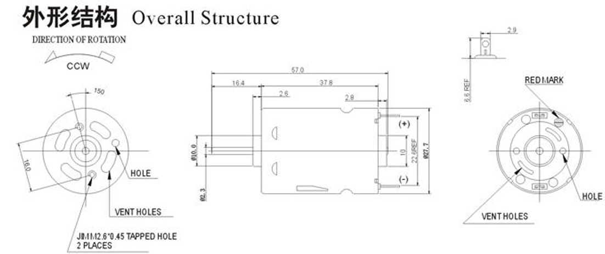

<b>图 2.1.1（1）我们购买的电机</b>

当然除了直流电机以外还有伺服电机和步进电机，这两种电机一般用于对动力的输出**要求更加精确**的场景，而且驱动方式比起直流电机来说会更加复杂。

#### 传动与转向与车架

这三个部分需要关注的点不多所以整理成一节。首先是**转向**，一般有**舵机转向**和**差速转向**两种方式。

**舵机转向**是一种使用舵机来控制车轮转向的方式。舵机是一个能提供很大扭矩且能控制转动到角度何种的电机，其内置一个单片机和周边电路控制。将舵机与轮子通过机构连接使轮子的朝向与舵机的转轴关联，即可通过控制舵机来控制轮子的转向。

**差速转向**是一种使用两台或多台电机来控制车轮转向的方式。左侧轮子向前而右侧轮子不动就会使小车向右侧偏移。**差速转向**会遇到一个问题，假设小车需要从转弯回正到直线时，电机不会减速而是只会减少出力，而减少出力使小车运动方向回正是需要时间的。其中的关键在于这个出力具体减到何值。一般使用**闭环反馈调节**来控制这个出力，这是差速转向独有的问题。

为什么说是独有，因为**舵机完成回正的时间很短**，只要轮子不打滑，这个转向可以瞬间完成。这是单电机带来的控制方式上的便利，根本原因在于小车左右轮子的转速是**通过机械机构来保持同步**的。缺点就是这个传动轴占用的空间会比差速转向要大。差速驱动的传动一般装在电机的输出轴上，和电机是一体的。在淘宝上卖的这种电机一般也会集成转速传感器，传感器对于闭环控制是必须的（作为反馈量，而且是很合适的反馈量）。

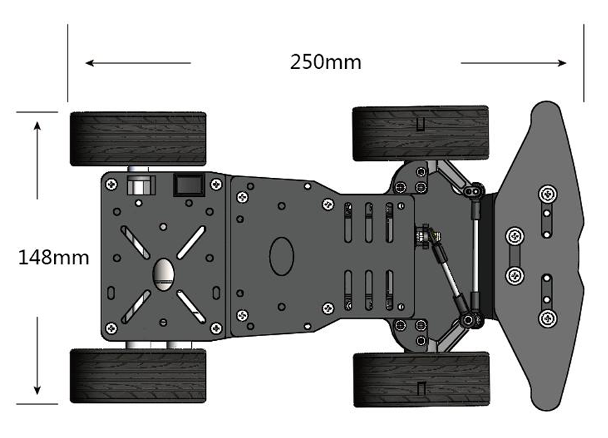

<b>图 2.1.2 （1）我们购买的车架</b>

最后是车架，车架上需要固定电机，传动和可选的舵机。因为差速控制的传动是装在电机上的，所以这类车架拿个有螺丝孔位的板子就行。而单电机的传动就需要更多的螺丝孔位，甚至，在竞速小车上车架和传动是安装在一起的连杆，这种车架一般被叫做**蚊式车架**（因为小）或者**RC漂移车架**，价格也是最贵的。我们小组最后选择的是单电机驱动舵机转向和一块金属板子。

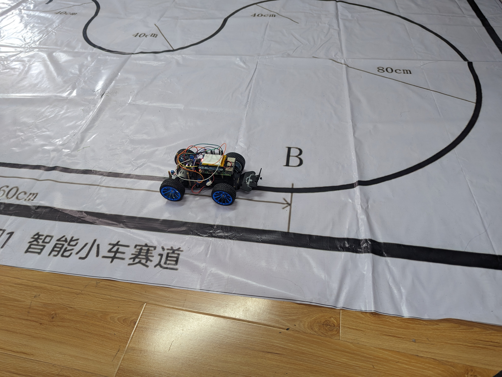

<b>图 2.1（1）我们小车在赛道上的样子</b>

### 外围设备

这部分其实比较宽泛，主要就是控制设备，传感器，稳压模块和电池以及诸如屏幕，扬声器等外设。下面将以从易到难得顺序介绍，其中金属探测和电机驱动与稳压是我们自己绘制的原理图和PCB，故单开两个小节。

#### 传感器与外设

总结下来外设有一个`ssd1306`的屏幕，一个2.5mm耳机孔的扬声器，一个`OV5674`的摄像头。前者具体使用见软件部分，扬声器使用树莓派的耳机孔的话会占用一个PWM频道，导致我们的PWM只能通过软件模拟操控（实际没有影响）。然后是摄像头，`OV5674`是一个国产的摄像头模组，手动调焦，兼容`libcamera`控制，见后文3.1.5 循迹算法与摄像头。`ssd1306`是一个`I2C`通信的小尺寸屏幕的主控芯片。

| 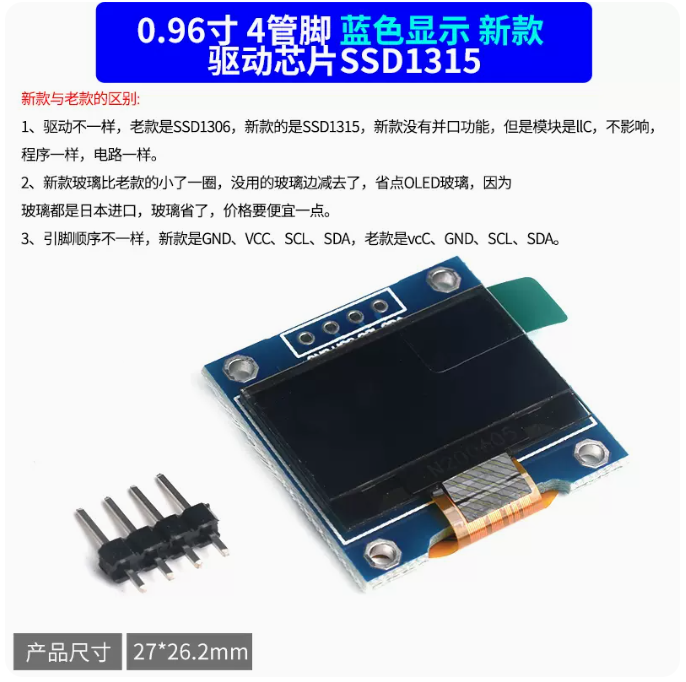 | 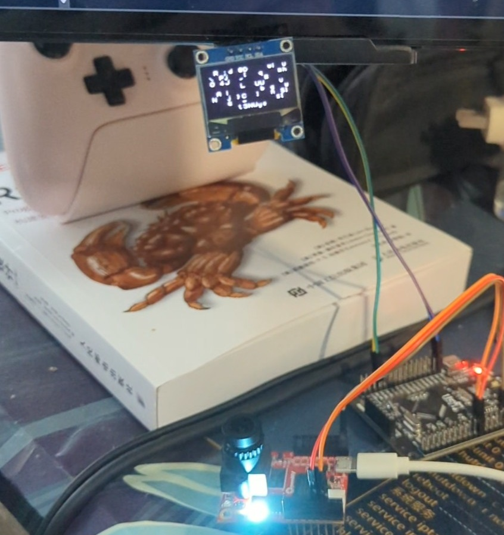 |
| ------------------------------------------------------------ | ------------------------------------------------------------ |
| **图2.2.1（1）我们购买的屏幕**                               | **图 2.2.1（2）屏幕在调试时样子**                            |

#### 控制设备

简单来说有三个可选项，可以分为有无操作系统，和是否使用单片机两个方向。两者有一个交集就是乐鑫全系使用`std`系列和使用`RTOS`。前者官方支持丰富但仅限`ESP32`，后者一个是对单片机资源有一定要求且学习成本较高。最后我们组选择了树莓派，友人C组选择了`STM32F103`。

### 金属探测模块

金属探测的核心是TI的`LDC1612`芯片，3.3供电，外围电路有时钟，震荡线圈和`I2C`接口。

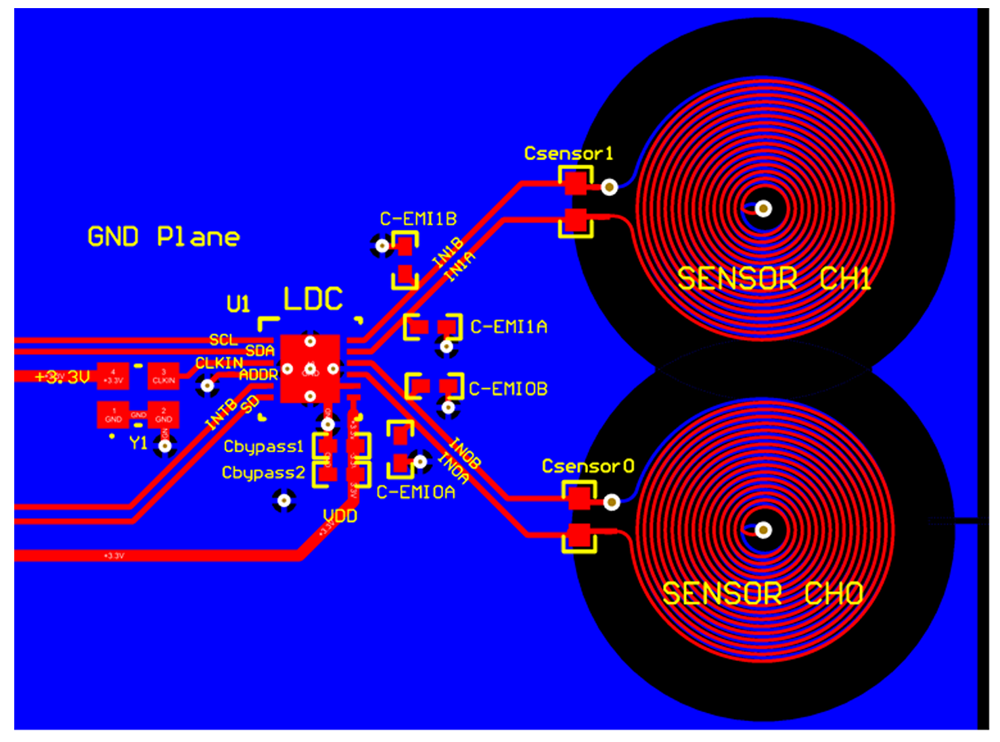

<b>图 2.3（1） LDC1612规格书PCB布局参考</b>

`LDC1612`的最后一位表示可以有2通道，但我们只需要一个。线圈的具体参数理论上需要通过TI官网的一个计算工具算出。但这有一个问题，直接在PCB上画线圈的画确实方便，但问题在于这样的话PCB就会离地有一定高度。假如因为这个高度导致读不出来就出问题了。

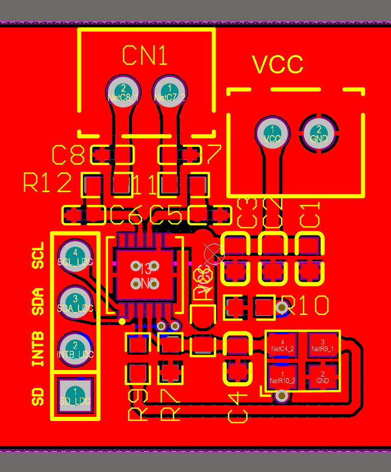

<b>图 2.3（2） 我们画的LDC1612传感器电路</b>

我们计划电源从左上角`VCC`两脚插座接入，然后经过降噪电容`C1 C2 C3`和保护作用的零值电阻`R8`供电给晶振和`LDC1612`。重点部分是左上角的`CN1`与它的周边电路。这里我犯了两个错误可以看到这里有两对起降噪功能的电容`C5-C8`，但按理来说只有`C6 C5`才应该起到降噪的作用，`C8 C7`应当作为感应电阻并联在`CN1`之间就是图*这里等图片序号整理好之后再添加*中的`Csensor`这个电容的值需要根据LDC1612手册的`8.1.2 L-C Resonators`的提示计算出一个合理的值。

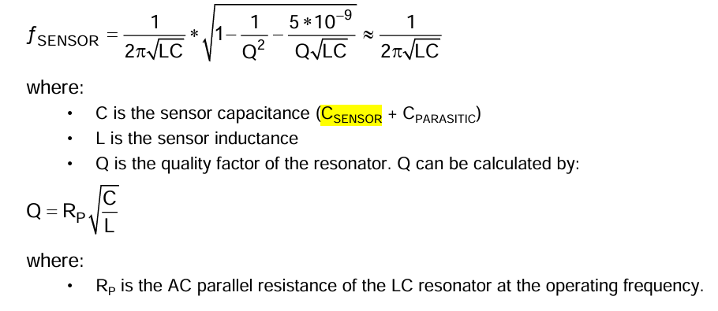

<b>图 2.3（3） Csensor计算公式</b>

假设我们希望30Hz的频率去读取，那为了安全起见我们希望传感频率也就是图中的 $f_{SENSOR}$ 为90Hz。其中线圈的电感会在购买时确定：

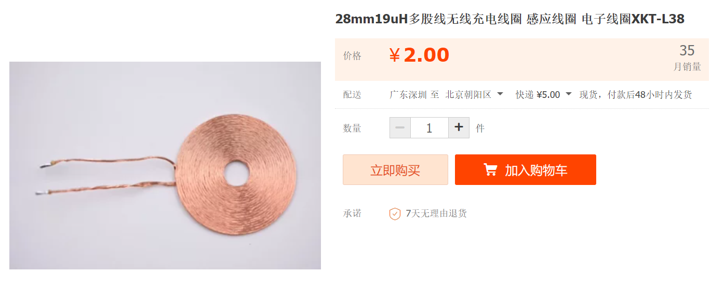

<b>图 2.3（4）我们使用的线圈</b>

两篇线圈串联得到的电感就是 $38\mu H$ 。为了对称我们可以直接选择并联一个 $38\mu C$ 的电容。但我们最好计算一下$R_p$也就是在我们设置的90Hz下的阻抗。在以上条件由仿真得到：

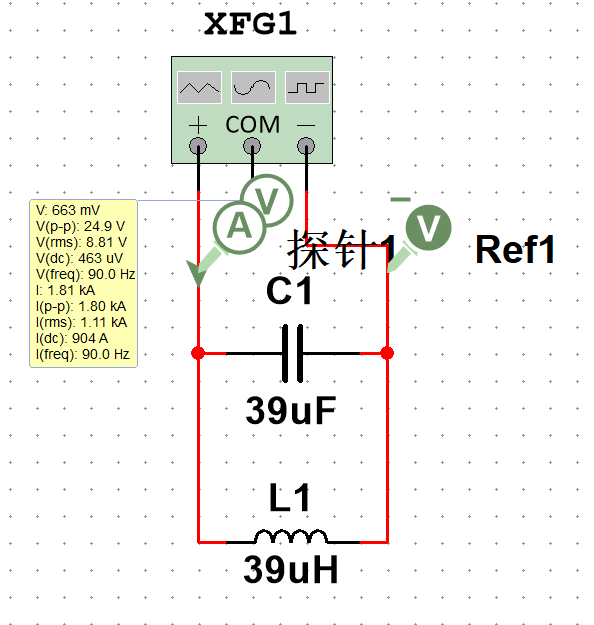

<b>图 2.3（5） 仿真传感电路</b>

得到$R_p\sim 13.83m\Omega$。就是品质因数的值而回看图中的计算公式，会发现公式中的开方变成虚数了。这可不行，所以只能并联一个电阻强行拉高它，这个电阻的值会和之后设置的一个寄存器有关，手册中的`Table 42. Optimum Sensor RP Ranges for Sensor IDRIVEx Setting.`给出了相应的值：

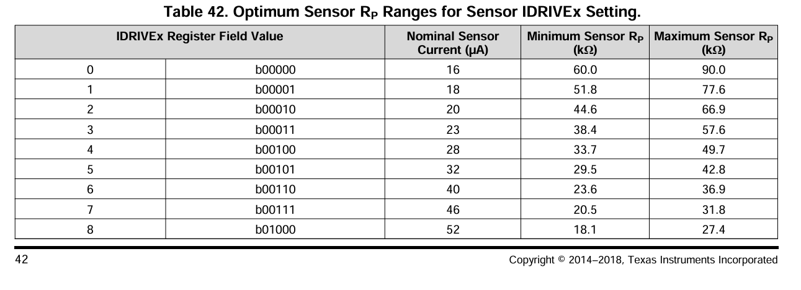

<b>图 2.3（6）LDC1612手册中截下的表</b>

这个表可以得到阻抗需要的驱动电流的大小，可以看到这里的值都大得出奇，是因为在电路设计中一般会让电路的**实部电阻大一点**，否则越靠近**谐振频率**这个电路的 $R_p$ 就越小，**品质因数就越大，效果就越差**。在最后我们选择看看能否在`C8 C7`之间焊接一个电阻以弥补我们在设计之初造成的缺憾，但事实证明这样会完全破坏感应功能（即没有报错也没有正确的数值）。所以最佳的情况还是直接根据官网的线圈设计工具触发为妙。

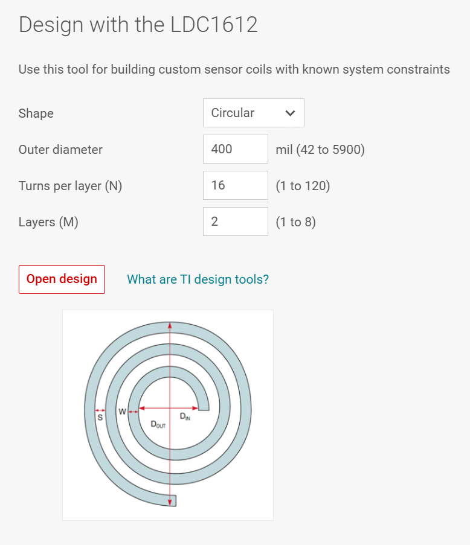

<b>图 2.3（7）TI官网的设计工具</b>

> 可问题在于，我们使用TI官网设计出来的线圈在嘉立创打板后得到的实物**一致**吗？这个问题我们是难以验证的。

在设计完硬件之后就只需要关注软件上的设置了。`LDC1612`是一个`I2C`设备，设置和读取数值通过`I2C`协议读取寄存器完成。详见后文3.1.4 金属探测软件部分。

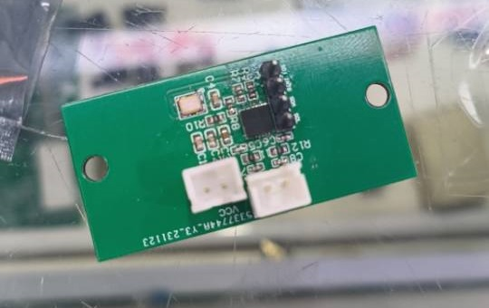

<b>图 2.3（8）板子焊好时的样子</b>

### 电机驱动和稳压

这部分就单纯看我花式吃亏了，几乎是把新手能犯的错全部犯了一遍。不像2.3节起码有一些学习得来的思考。首先看PCB，总共分为三个模块：

<b>图 2.4（1）我们画的金属电机驱动与稳压</b>

#### 电机驱动

这里犯的错是直接把控制用的PWM接到了芯片上。这是一个假设电机驱动的供电出了问题才要考虑的（现在看来真确实很有可能）现在一种比较新的做法是使用光耦元件，它替代了传统的MOS管构成的开关电路：

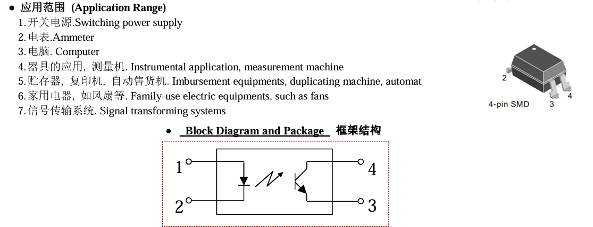

<b>图 2.4.1（1） PC817C的介绍</b>

这种元件比起MOS会有更快的工作频率，比起比较器来说虽然反应速度比不上但布线会轻松不少。况且这种元件能实现完全的分离两部分电路只留控制信息。除此之外的一个点是尽量给这种元件的底部加上一些过孔怎加散热。

#### 供电

这部分犯的错是没有更加完整地了解供电相关的一些知识。首先我们板子处理完后上电没有问题，但一带负载整个电路的电压就掉了下来。我们把电池的位置接到实验室电源时实验室电源的电压也被拉下来了。但直接接到电机上是没问题的。当时我们只能说这块板子寄了，问题浮现要到验收的1天前我刷到一个视频讲了这个问题。但很明显我们是没有时间的，在视频开头老师林林总总列出了8种导致电源出问题的原因，现在板子也被清理201（实验室）时清理走了，只能猜测一下。

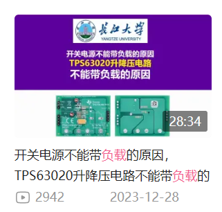

<b>图 2.4.2（1）讲解视频BV1D64y1J75u的封面</b>

首先最可能的原因是我在9V供电中犯了一个比较离谱的傻，当时计算器计算需要的电感，然后感觉再买一个新规格的电感有点亏，然后看看手上的已经有的，发现有两个并联起来好像差不多。于是就这样画了，结果是本来设定的9V实测8.34V。这是第一个问题。

第二个问题是我们选择了错误的电机驱动芯片。我们购买的电池是三块锂电池拼起来组成12V的普通电池，但电机驱动芯片标定输入为11.4V，所以不得不降下来。现在看来，与其设计一个非常复杂的电源芯片，不如选择合适的电机驱动让电源直接借到芯片上（加点降噪电路足够）。

这部分电路的设计就可以说没什么难度，只需要配上非常饱和的降噪电容和完全正确的电感。我们使用`drv8212`作为电机驱动芯片，使用`TPS5430`作为降压芯片。两者的规格书都有中文，可惜上面没写带负载的问题。

