# 智能小车报告

::: warning
这是报告的第二部分，第一部分是[智能小车报告-硬件](./report/智能小车报告-硬件)
:::

## 软件部分

代码部分我们完全使用`rust`实现，包括单片机也是。这门语言在国内应用不多也很年轻，所以我们无法在网络上找到能使用的代码直接让我们的车跑起来（当然也使用了一些开源库）。选择这门语言而不是理论上我们较为熟悉的C语言是因为C语言其实有很多不好的性质。

当然代码本身是不太重要的，下面会着重一些设计思路和编程语言带来的便利。具体代码实现见仓库https://github.com/nan-mu/car.git

### 树莓派控制

编写代码时遵从面向对象的原则，所以首先编写了一个控制对象，以下是声明：

```rust
pub struct ControlManger {
    motor_pwm: (gpio::OutputPin, gpio::OutputPin), // 电机控制引脚，第一个为正向驱动引脚
    senvo_pwm: gpio::OutputPin,    // 舵机控制引脚
    motor_tasks: VecDeque<ControlMes>,
    launch_mode: LaunchMode,
}
```

在`rust`中对象由`struct`构造，声明时只声明其属性，实现的函数放在`impl`块中。在这里可以看到我们把电机需要的一些引脚的类型放在了这里。这是一种类型，但在`rust`中类型是一个很重要的逻辑优化的方式。比如在倒数第二行我们可以看到这个`launch_mode`需要一个`LaunchMode`类型的变量，这个变量是我自己声明的：

```rust
pub enum LaunchMode {
    Sleep,
    Debug,
    Brake,
    DeadWhell,
}
```

本质上，`LaunchMode`是一个`enum`（枚举），它有四种`变体`。他的作用在C语言中一般使用`#define`宏实现，但假如有这么一句话`#define Sleep 0`，那在接受它作为参数时，C语言接受的是一个数字，但`rust`会检查你传入的是否是`LaunchMode`这个类型的变量，在编译后`Sleep`在两种语言中都是0，但`rust`中我们传入一个0是会报错的，有了这种严格的类型检查`rust`不仅在语义和可维护性上有很大提示并且可见地，在编译优化上`rust`可以让其后端更加合理地构建抽象代码树，因为C语言的宏在预处理阶段就把宏拆开了。

> 就行C语言的宏，我们一般使用全大写下划线分割来命名宏一样，`rust`也有一套命名规则，一般‘类型’，诸如`struct`和`enum`，使用大驼峰命名法，函数使用全小写下划线分割。这种命名规则会在编译期间检查并以`Warn`级别告诉你。所以`rust`的代码比起没有这种检查的语言来说看起来会更加规范。

说回功能，围绕`ControlManger`的流程非常简单，需要关注三个函数`new`，`load_stats`和`launch`。


#### `new`

具体来说这部分干两个事，一个是初始化日志，一个是初始化`ControlManger`。`rust`‘约定’一个`struct`的构造函数为`new`函数，这是因为你可以取另外一个名字。我猜测这是由于`rust`不允许函数名复用。在C语言中一个类可以有多个构造函数但接收不同的参数，在`rust`这是不允许的。说会功能，日志功能我们使用了一个第三方库`log4rs`，初始化比较复杂但使用起来会很方便。具体含义见注释：

```rust
//这个函数的声明会很奇怪，具体见下文
let stderr = append::console::ConsoleAppender::builder()
    .target(append::console::Target::Stderr)//构建一个对象，该对象将日志附加到控制台，并将err类别的输出链接到控制台中
    .build();//rust是一门函数式编程语言，很多函数的返回值是对象本身，所以可以一个函数接另一个函数。类似于C语言的cout，使用时重载了<<操作符，<<操作符就是把当前内容拼接到sstream再传回被修改的sstream。在rust无需担心对象会被多次构造，毕竟本身就是以函数式编程为目标开发的（可见构造ACT更容易了）
let log_file = append::file::FileAppender::builder()//日志附加到文件
    .encoder(Box::new(encode::pattern::PatternEncoder::new(
		"[{l}][{d(%Y-%m-%d %H:%M:%S %Z)(local)}] - {m}\n",//规定日志输出格式，这里的d()(local)表示使用本地时区，{l}表示日志级别，{m}是具体内容
    )))
    .build(format!(//这是一个宏语句，类似C语言的sprintf，模式语法和python一样
		"log/CAR_{}.log",
		Local::now().format("%m-%d_%H-%M-%S")//Local是一个时间库的时间类型，Local::now()就返回本地时区的时间，format是将该时间对象以参数给出的模式转换为&str（简单理解为字符串即可）
    ))
    .unwrap();//见下文
let log_config = config::runtime::Config::builder()//这是构建一个专门记录配置信息的对象
    .appender(config::Appender::builder().build("log_file", Box::new(log_file)))//添加‘日志附加文件’对象，第一个值是对象名，第二个值是一个对象指针
    .appender(
		config::Appender::builder()//添加过滤器，这个就在这个括号里现场构建了
    		.filter(Box::new(filter::threshold::ThresholdFilter::new(
				log::LevelFilter::Info,//这里的log其实不是log4rs里的东西，而是rust标准库的log，这里表示链接标准库的Info输出。可以看到之后我们打的日志是打的标准库的日志，这里就把它链接到log4rs上然后log4rs格式化后输出到文件和控制台里
   			)))
			.build("stderr", Box::new(stderr)),
    )
    .build(//如题，下面的部分其实从意义上无法解释，相当于log4rs有两个日志设置，一个是正常的日志，一个是根日志。
		config::Root::builder()
    		.appender("log_file")
    		.appender("stderr")
    		.build(log::LevelFilter::Trace),
    )
    .unwrap();
let _handler = log4rs::init_config(log_config).unwrap();//如题，将配置导入到日志对象中。这里的变量名加了一个_，表示这个变量将不会被使用。所以可以不把它放到一个变量中的。rust的编译器会检查每个变量是否被使用，否则也会报一个Warn级别的错。
```


现在来解释下注释中提到的两个问题。首先是第一行的

```rust
let stderr = append::console::ConsoleAppender::builder()
```

这里使用的函数为`builder`，但前面跟了长长一串声明，这个声明使用`::`分割，本质时一个路径，前两项是模块，都是小写，最后一个是`ConsoleAppender`，这是一个`struct`，然后调用这个结构体的`impl`块下的`build()`函数。可以说，`ConsoleAppender`也是写在模块`console`的声明块里的（impl aka *implementation* 声明，也可以叫做实现）。所以，根据这句话我们可以知道，`log4rs`包下的`src`文件夹有一个`append`文件夹，下面有个一个`console`文件夹或者一个`console.rs`。若是前者，那`ConsoleAppender`会写在一个叫做`lib.rs`文件中。若是后者就是写在`console.rs`里了。但第一句`append`需要我们自行导入，比如这是我写的`drive.rs`中引入的模块，可以当它就是命名空间，但这样的写法可以在编译阶段更加容易地实现引入文件：

```rust
use chrono::{DateTime, Local};
use log::info;
use log4rs::{append, config, encode, filter};
use rppal::gpio::{self, Gpio, Level, Result};
use std::collections::VecDeque;
use std::thread;
use std::time::Duration;
```

每一句`use`开头的第一个字段都是已经安装的源码，这部分通过类似`python pip`的`cargo`实现。比如我们要使用`chrono`，那就在项目根目录运行`cargo install chrono`就可以使用`use chrono::{DateTime, Local};`我的习惯是引用到对象的上一次层，这样在所有外来函数前都会跟上一个`::`，以便于区分函数到底是谁。

第二个问题是一个`unwrap()`函数，这是一个`rust`的`core`函数（`rust`自带的库分为`core`和`std`，简单来说后者需要借助操作系统的加持，前者理论上不用，具体内容见后文3.2.1 与树莓派之间的不同）。`unwrap()`声明在`Option`这个枚举中，一般在`rust`中处理一个枚举是使用`match`语句，这是一个`if`的封装（反正这种流程控制语句都是移动pc，所以实现起来都是一样的），拿之前我写的`LaunchMode`举例：

```rust
match self.launch_mode {
	LaunchMode::Debug => {
		info!("任务添加：调试模式");
		...
	}
	LaunchMode::Brake => {
		info!("任务添加：制动模式");
		let killed_task = self.motor_tasks.pop_front().unwrap();
		...
	}
	LaunchMode::DeadWhell => {
		//任务，160cm直线，80cm转弯180°，40cm转弯45°，40cm转弯180°，40cm转弯45°
		...
	}
	LaunchMode::Sleep => (),
};
```

简单来说就是一个更加可读的`switch`，而`rust`中使用枚举来管理错误，在c语言中我们使用`try to`语句来捕捉错误，或者一个函数返回一个数字，每个数字代表着不同的错误类型。前者的思路被`rust`沿用，因为对于前者，假如代码的错误类型很多，那`try to`语句就会很复杂且繁琐，后者的缺点是返回值就被这个错误标志占用了。解决这两个问题的方案就是使用枚举和泛型来实现。

这点在C语言中其实非常反直觉，我们确定一个函数的返回值，需要知道返回值的类型以便于申请足够的内存空间。但假如一个函数，（注意是一个函数不是模板也不是宏），返回两种类型的数据，那我们只需要在这两中返回值的类型的大小中取一个最大值来开辟就行。但C语言就不行，甚至这个问题还会体现到一些流程控制语句中声明。那在`rust`我们会一个枚举，分两种情况，需要传回错误的种类和不需要传回错误的种类，分别是`core::result::Result`和`core::option::Option`：

```rust
pub enum Result<T, E> {
    Ok(T),
    Err(E),
}
pub enum Option<T> {
    None,
    Some(T),
}
```

这个尖括号里是泛型，这里它和C语言的模板泛型有一样作用。这两个类型都在`core`的预导入模块当中，不需要像之前那样复杂地声明。所以我们需要返回错误信息的函数就返回一个这样的枚举，拿读取数据举例，假设一个数据从数据库读出来，那可能为`NULL`或者字符串。但值为`NULL`时该值可以从另外一个值构建（这个例子出于我的数据库作业），那读出`NULL`这个错误‘就是可恢复的’，我们就用`match`。反之遇到了一个我们认为不可恢复的错误，比如1+1=3，那我们就让程序`panic`，也就是恐慌。这是表示程序应该直接退出。这时候我们就不用`match`而是使用`.unwrap()`。这里题额外的一点，在`rust`中，一个对象的成员函数加入想读取对象的属性，那需要在声明时形参加上`self`，可以这样理解：`self.a() == a(self)`。而`unwrap`的`self`就是一个`Option<T>`或`Result<T>`枚举，返回值类型是`T`。

类似的函数还有很多，比如`expact(self, msg: &str)`。也是解开一个`Option<T>`或`Result<T>`，但在程序恐慌时会附带一个文本信息`msg`。

说会主线，现在我们完成了初始化日志，现在在代码的任何地方只需要这样一句：

```rust
info!("初始化调度器");
```

这个函数带了一个感叹号，表示是一个宏语句。在`rust`中的宏一般用于编写‘写代码的代码’，使用类似之前`format`的方式取匹配和拼接参数（这也导致宏语句一般难以维护）。这里的宏简单来说就是输出一个等级为`info`的日志，它属于标准库的`log`（之前提到过`log4rs`会去捕获标准日志）。在C语言里我们可能需要把一个日志对象在不同的作用域中传来传去（`rust`的一些机制去努力地避免这种情况），但在`log4rs`中不必如此。

剩下一个工作是构建控制对象，也就是把`ControlManger`的每个属性填满。我们可以看到这部分内容一般都是初始化一些控制引脚，我们使用`rppal`库来实现（也没别的选，触发去调用`.dll`）。该库的控制逻辑非常明确：

```rust
Self {
	motor_pwm: (
		Gpio::new().unwrap().get(20).unwrap().into_output_low(),
		Gpio::new().unwrap().get(16).unwrap().into_output_low(),
	),
	senvo_pwm: Gpio::new().unwrap().get(23).unwrap().into_output(),
	motor_tasks: VecDeque::new(),
	launch_mode,
}
```

这是`ControlManger::new`的最后一句话，`rust`把一个函数的最后一个值（在C语言中可以理解为字面值）作为函数的返回（`return`的语法糖）。使用`Self`关键字来直接生成对象，因为这期间可能会有一些泛型关系的传递导致对象声明边长，使用`Self`关键词可以让这部分的代码更加容易维护。我们之前提到过`self`，理解它们可以参照之前提到的`rust`命名规范，所以`self`是对象，`Self`是对象类型。

还有一个语法糖，我们在声明时，假如一个需要的属性和我们构建它的对象同名，那么我们不用写成`launch_mode: launch_mode,`，直接写成`launch_mode,`即可。这些语法糖都非常顺直觉或叫符合人体工学，使得开发过程比起C语言来说轻松不少。

说会主线，在之前介绍`drive.rs`的依赖时就有这样一句：`use rppal::gpio::{self, Gpio, Level, Result};`所以这里的`Gpio`就属于`rppal::gpio`（这里同样有一个`self`，我们这样理解`use a::self == use a`）。语法也非常好懂，先`new()`，因为可能失败（比如驱动或者设备损坏）所以需要`.unwrap()`。然后`.get()`这里跟上引脚好，最后设置推挽输出初始为低电平。

后一句`motor_tasks`后的`VecDeque`是`rust`标准库中的变长双端队列，在C语言中我们使用这种`STL`容器时一般会指定类型，在`rust`中同样。只不过在之前什么时我们已经声明了`motor_tasks`的类型是`VecDeque<ControlMes>`。所以编译器就能够推断出这里的`VecDeque::new()`需要返回一个什么样的对象。这是一种语法糖，也是`rust`希望培养的一种用户习惯，即我们应该在任何时候明白我们每个变量的类型并相信编译器也知道，假如编译器不知道就是写错了，这种习惯会省下很多事。

#### `load_stats`

一开始我的打算是写一个很简单的状态机，一些函数往队列里丢状态，一个函数往队列里取出来并执行。而`load_stats`就是这个读任务的函数，就是一个match语句就不对赘述了。值得一提的是我们最后比赛只使用了`DeadWheel`这一个控制，因为来不及些反馈控制，所以只用写死就好，那本身只有一个状态。当然除此之外为了得到这个写死的控制路径，我们需要进行大量的测试，所以也可以看到其他类型的指令。

当然读状态是它，具体执行是其他函数。没啥亮点属于一看文档会会写的程度。所以我打算在这一节介绍一些这些状态任务之间我是如何传递数据的模式。简单来说，轮子在每一秒不是转就是停而且还有速度，舵机在每一秒都要维持一个角度。每个控制信号都有开始时间，预计持续时间和结束时间。所以就有了以下对象，一些比较简单的就略过了：

```rust
///控制信息
#[derive(Debug)]
pub struct ControlMes {
    /// 控制模式
    mode: Gear,
    /// 转向角度
    diversion: Diversion,
    /// 控制信号持续时间
    duration: Duration,
    /// 任务的注册，运行，弹出（被打断和完整完成）的时间
    date: Times,
}
```

作用的话不是重点，但可以讲解一些使用`rust`的思路。`rust`的一大特点就是标准。打个比方，在C语言中这样一个数据结构我们希望能转成字符串打印出来，我们可能会写一个专门的函数接受这样的一个`struct`作为参数，或者在一个类里写一个成员函数自己返回一个字符串。换句话说，我们传给输出函数只认字符串之类。但在`rust`中，我们使用`trait`（特性，特征）来实现。比如这里我使用了一个宏（`rust`有两种宏语法，之前介绍的是声明式，这个叫过程式）。简单来说，声明这个`Debug`宏代表你给这个结构体添加了一个`fmt::Debug trait`，这个`trait`。而`rust`中，我们使用`trait`来约束泛型。我们先来看看`std::fmt::Debug`的代码长什么一样：

```rust
pub trait Debug {
    // Required method
    fn fmt(&self, f: &mut Formatter<'_>) -> Result<(), Error>;
}
```

`pub`表示可以在任意级目录下引用该`trait`（`rust`不使用C语言的`#include`和类的`public`、`private`来约束访问权限，而是通过路径）。所以，有两个程序，一个程序约定参数泛型需要满足`fmt::Debug` `trait`，那他就可以调用`fmt`这个函数。这是顺直觉的，因为根据该函数的声明可以得到输入和输出所需的内存空间。所以所有开发者写的任何一个需要转换成字符串的结构体，可以自己实现`fmt::Debug` `trait`，其他人就可以使用`fmt::Debug::fmt`这个函数。当然我们一般不会直接使用`fmt::Debug::fmt`函数，而是用在`std::fmt`的一些结构化函数中（`fmt` aka `format`）。比如`format!()`和`print!()`两者是声明式宏（宏的语法也比较类似函数，所以能使用泛型规定`trait`而不是C语言单纯的替换）。具体语法是这样：

```rust{2}
#[derive(Debug)]
struct Point {//这里使用docs.rs/std里的例子，网站的具体介绍见后文3.1.3 第三方模块
    x: i32,
    y: i32,
}

let origin = Point { x: 0, y: 0 };
assert_eq!(format!("The origin is: {origin:?}"), "The origin is: Point { x: 0, y: 0 }");//该宏用于表示每个参数之间是相等的
```

所以在开发过程中我们希望看一看参数传递中到底发什么了什么，便不用化时间去写转成字符串的函数，只需要一句`#[deive(Debug)]`即可。当然有时我们还是希望按照自己的意愿来转换成字符串，这时我们会为`struct`声明`fmt::Display`这个`trait`。这样在格式化语法中，可以使用`{}`作为占位符，为之前说的`fmt::Debug`需要`{:?}`作为占位符。

#### 第三方模块

之前提到`trait`的最大作用是利用`rust`在路径上构建的引用机制。这代表这一种程序员之前约定的标准在代码中的体现。这是在多人协作时才会遇到的问题。比如我为一款`ssd1306`屏幕实现驱动程序，那在初始化时肯定需要取得能够实现`I2C`引脚的使用权。这时我们与其写死一种引脚对象的类型作为参数，不如在一个泛型上约束能够启用`I2C`功能。这样在单片机或是树莓派的代码就可以写成一样的了。否则可能需要为每一种型号的设备都写一遍驱动程序就太抽象了。

> 似乎C语言真需要如此，比如STM32的`PWM`就是`PWM`，但ESP32的PWM分为`LEDC`和`MCPWM`，两者的HAL库肯定不同。

但空口无凭，我们来验证一下到底单片机和树莓派能否使用相同的代码控制一个`ssd1306`屏幕。验证的方法也很简单只需要从代码上理论正确即可

> 代码正确即运行正确在C语言中看来可能有些牵强。但在`rust`中这是很有可能的。`rust`是一名函数式编程语言，这代表着它必须满足变量所有权，这大大减小了维护内存安全的问题。`rust`有一个官方支持的懒加载的编译提示工具。这使得`rust`在编译/编写时就会尽可能地把问题暴露出来，即把运行时查错的工作量放到了编译/编写时。

首先，`rust`有着类似`node`或`python`的`npm`或`pip`，它叫做`cargo`。该工具的一大功能就是使用类似`pnpm`的思路管理第三方软件（取其精华去其糟粕，没有`pnpm-store`）。比如之前提到的的`rppal`和`chrono`，我们可以像使用`apt`一样安装：

```sh
cargo install rppal chrono
```

那这些代码存在哪里？我们可以在看到它们的文档？在C语言中这可能因不同库而异，有的可能有`github`仓库，有的可能有官网。但在`rust`中我们一般只需要关注`docs.rs`。我们再此搜索`ssd1306`：

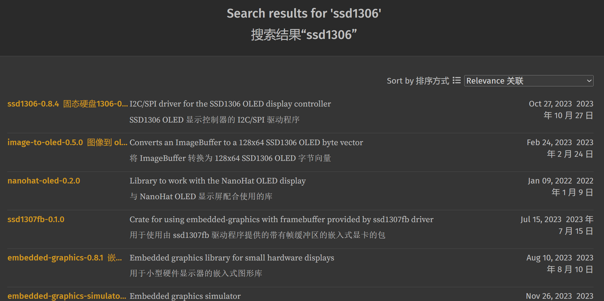

根据一个简短的介绍我们就可以大致了解功能，点击第一项就可以到达文档首页。该页面是程序自动生成的。`cargo`集成了文档生成器，它会捕获`rust`项目中的`Cargo.toml`从中提取版本号、名字、简介和依赖，从代码中了解项目结构，代码中所有函数，`struct`，`trait`，宏等等所有东西为你写的每一句代码生成组织合理的html页面（当然可以通过过程宏关闭它）。并且会捕获的`#[doc=""]`宏或是`///`文档注释添加到html中。结果就是，你熟悉了一份`rust`第三方库的“读法”就可以读懂所有`rust`第三方库，你无需为自己的开源库编写文档只需要开发时编写正确的注释。那现在就来享受这份遍历，我们看看`ssd1306-0.8.4`中哪里写了要求何种引脚，首先在首页的文字说明中我们可以了解到通过`Ssd1306::new`函数初始化，然后根据函数声明发现需要满足的是`WriteOnlyDataCommand` `trait`

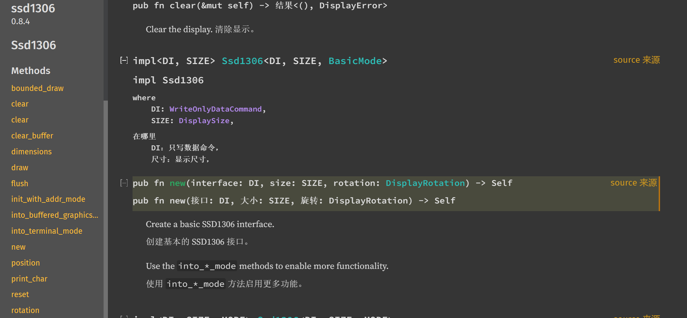

> 如果对代码还有疑问（通常发生在注释不完善时），点击右侧的`source`就可以跳到这句声明在代码中的实现位置。


点击`WriteOnlyDataCommand`，跳转到该`trait`的页面，发现这里注明了作者以为`I2C`和`SPI`两种控制方式实现了该`trait`

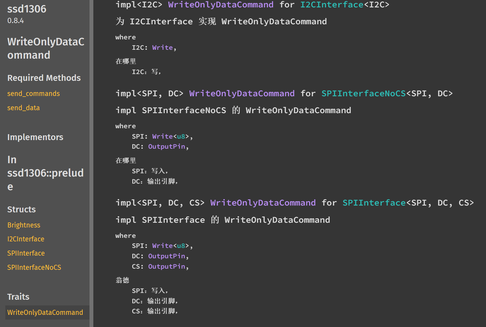

但具体来说，`I2C`是一个名为`I2CInterface`的结构体，这个也是包含在`ssd1306-v0.8.4`中的，构建他需要一个满足`Write` `trait`的对象，而这个`trait`是声明在`embedded-hal-v0.2.7`中。

> `embedded-hal`在24年1月9号更新到`v1.0.0`，具体细节见后文3.2.4 `HAL`。
>
> > 使用一门新的语言编程真是有一种勃勃生机万物竞发的感觉，你永远不知道你需要看多少迁移指南和过时的教程。

假设我们的代码将在`stm32f103`中运行，在`docs.rs`中搜索它得到：

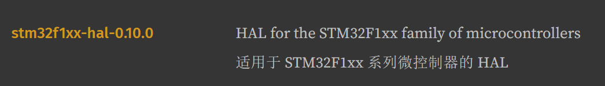

这样我们就找到了它的`HAL`库，我们跳过一些中间过程直接看`I2C`的相关`trait`：

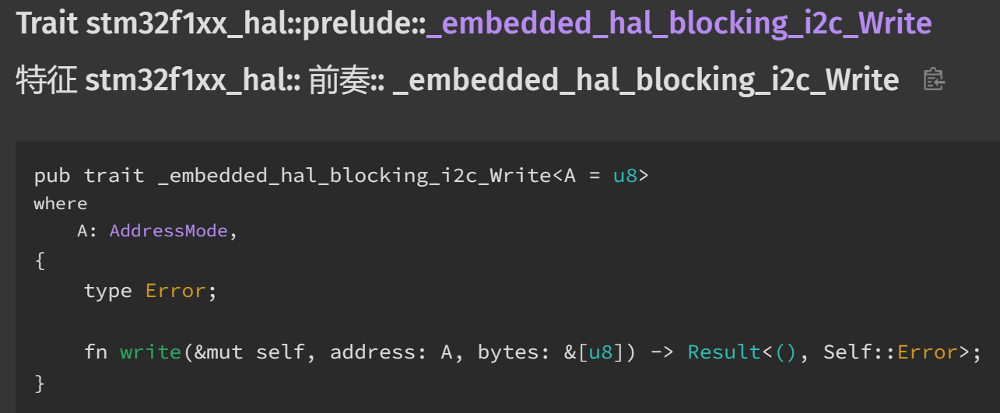

而这时定义在`embededd-hal-v1.0.0`中的`Write`：

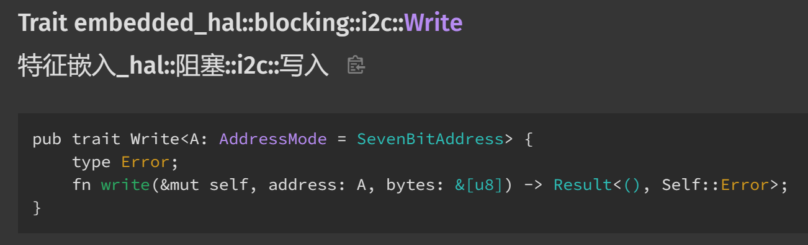

我们可以发现在`stm32f1xx-v0.10.0`中的这个`trait`的名称其实是`embedded-hal-v1.0.0`中`Write` `trait`的路径，编译器读到该`trait`的名称后会根据这样的路径查找所指向的`trait`，然后检查两个`trait`声明的函数签名是否一致，假如一致则将`stm32f1xx_hal::prelude::_embedded_hal_blocking_i2c_Write`转换为`embedded_hal::blocking::i2c::Write`。这样我们在`stm32f1xx-v0.10.0`中后见的`I2C`对象就可以传输到`ssd1306-v0.8.4`的函数当中。

现在来看树莓派的实现，同样跳过中间搜索，树莓派的支持库我使用的是`rppal-v0.16.1`，从浏览器的地址栏我们可以知道该html页面显示的是树莓派的`I2C`实现，我们又见到熟悉的`embedded-hal-v0.2.7`

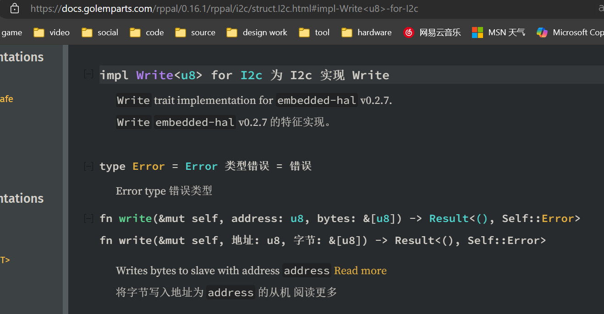

`trait`的设计在我看来是`rust`领先传统高级语言的最大特点之一，它服务于`rust`庞大的开发者社区，为我们带来了远超C语言的编程体验。


#### 金属探测软件部分

上一节我们谈到使用`ssd1306-v0.8.4`控制屏幕，使用的协议为`I2C`。但假如有这样一块产品没有人为它编写驱动代码，或是我们需要自己调试一些功能。这要求我们能够自行编写驱动程序。简单来说，我们要会用`rust`操作`I2C`引脚，先给出代码

> 这部分的代码仅用于测试所以并未出现在`master`分支的顶端，如需查阅请移步`master`的`980e43d` commit
>
> 🗒️：`验证了我自己画的金属探测确实有问题`
>
> 🔗：[https://github.com/nan-mu/car/commit/980e43de91181b413f87a4d4d1600dda2c05547a](https://github.com/nan-mu/car/commit/980e43de91181b413f87a4d4d1600dda2c05547a)

```rust
fn test_i2c() {
    use rppal::i2c::I2c;
    // let sd = Gpio::new().unwrap().get(4).unwrap();
    // sd.into_output_low();
    let mut iic = I2c::new().unwrap();
    iic.set_slave_address(0x2b).unwrap();
    iic.block_write(0x08, &[0x00, 0x08]).unwrap();
    iic.block_write(0x10, &[0x00, 0x0a]).unwrap();
    iic.block_write(0x14, &[0xf3, 0xff]).unwrap();
    iic.block_write(0x19, &[0x00, 0x00]).unwrap();
    iic.block_write(0x1b, &[0x02, 0x0c]).unwrap();
    iic.block_write(0x1e, &[0x90, 0x00]).unwrap();
    thread::sleep(Duration::seconds(1).to_std().unwrap());
    iic.block_write(0x1a, &[0x16, 0x01]).unwrap();

    let mut DATAx_MSB = [0u8; 2];
    let mut DATAx_LSB = [0u8; 2];
    iic.block_read(0x00, &mut DATAx_MSB).unwrap();
    iic.block_read(0x01, &mut DATAx_LSB).unwrap();
    println!("{:?}, {:?}", DATAx_MSB, DATAx_LSB);
}
```

在树莓派上启用`I2C`接口其实较为容易，初始化，设置从机地址就可以使用了。`rppal`提供了能当原子指令使用的阻塞式读写。

写操作每次传输8位数据，地址8位，所以地址格式位`u8`，数据格式位`&[u8]`

> `u8` 即无符号8位整数，可以使用任意进制表示，比如这里的16进制。
>
> `&[u8]`指一个`u8`类型的数组的引用，引用可以理解为一个受限的指针


读操作语法和逻辑类似。这里不多赘述。了解这些寄存器和编程的步骤我们需要回到`LDC1612`的规格书，首先是写寄存器的部分，参考 Table 47. Recommended Initial Register Configuration Values (Single-Channel Operation) ：

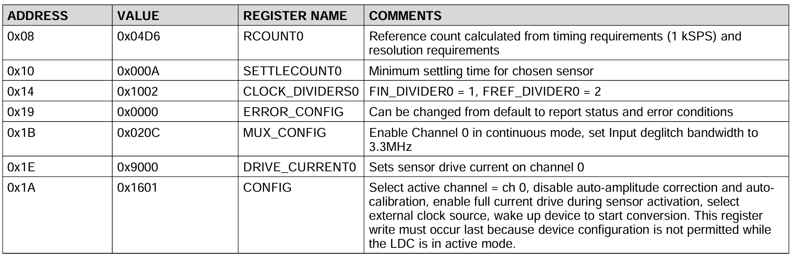

这里列出了单通道工作下需要关注的寄存器的值，所以下一项工作就是找到每一个上面提到的寄存器看看它到底指向了何种设置功能，结合我们自己的情况算出合理的值。这里拿0x08举例，它的声明为：

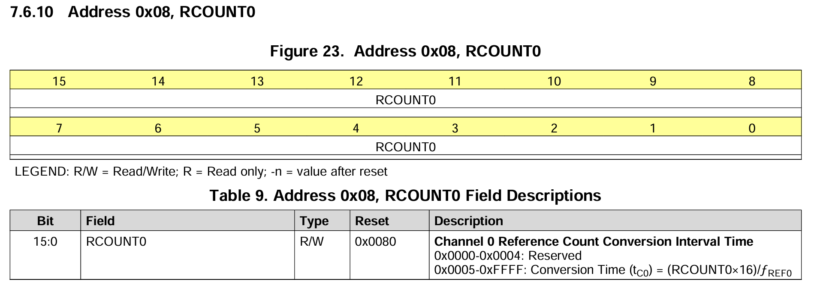

根据描述，该寄存器用于分割转换时间与依赖频率之间的关系，如图所示。所以我们可以根据我们自定义的转换时间和之前已经计算的依赖频率得出该寄存器的值。而依赖频率来自寄存器0x14：

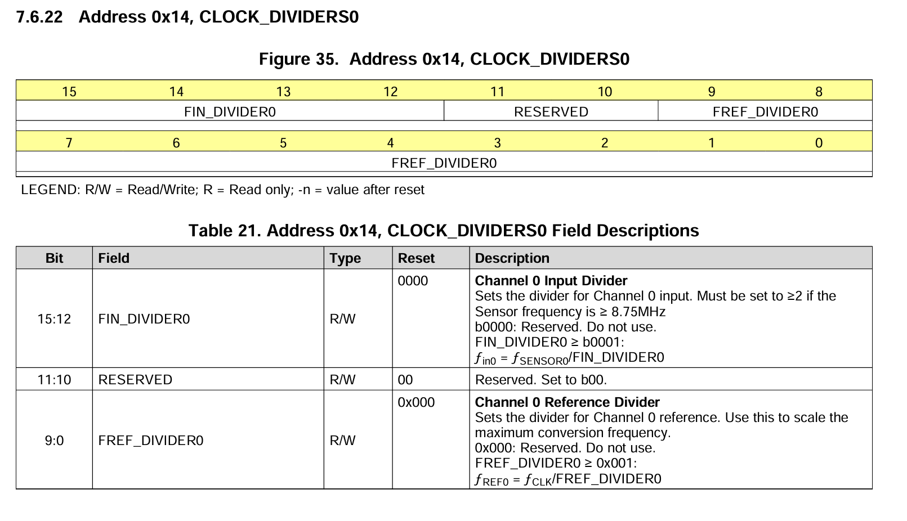

该寄存器的9-0位描述了时钟频率和依赖频率间的关系，根据说明，在接入外部时钟是时钟频率就是外部时钟频率，在我们设计的PCB中使用的是4MHz的有源晶振。至此设置0x08寄存器的所有位置量都已经排除。照葫芦画瓢，我们计算出了其他寄存器的值，完成了编程。可惜一来我已经提前回家，二来当时使用的线圈已经在201（实验室）的一次大扫除中被丢弃，我们已经无法复现这段代码的运行结果。也就是0x00和0x01，我们先只关注0x00：

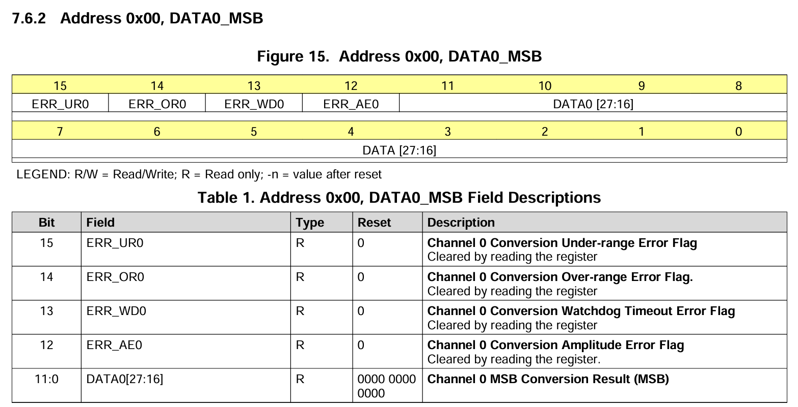

因为他的前4位位错误标记，为0表示没有报错。但经过我们的测试，在连接线圈的引脚断开时0x00和0x01都为0x0000，在连接线圈后无论如何改变线圈与多种形状的金属的举例，都无法使寄存器的值发生改变，但报错位一直为0。以上就是我们组在金属探测方面的全部努力了。


#### 循迹算法与摄像头

由于时间问题，我们组的循迹方案未能应用在最后的验收当中。但我们也做出了一些尝试和学习工作。

首先是摄像头。这里遇到的问题是在23年11月份左右树莓派淘汰了之前使用的相机上位机，使用了更加泛用的`libcamera`。导致现在没有`rust`的第三方库可以直接驱动相机。唯一的办法是使用标准库的`std::process::Command`去启动`libcamera`的控制台程序完成拍照。通过附加参数可以控制输出照片大小和位置。这部分内容详见`libcamera`官网这里不过多赘述。

然后是循迹算法，首先相机得到这样一张图：


<center><b>图 3.1.5（1）小车上相机拍摄的图片</b></center>

二值化并缩放得到这样一个矩阵：

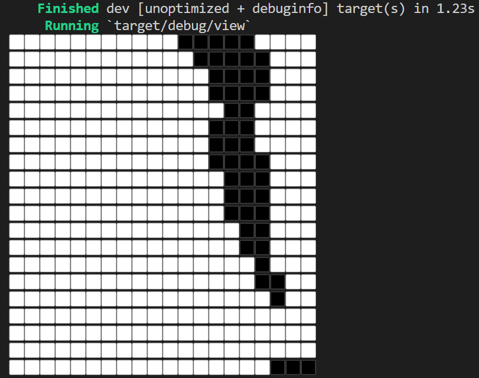

<center><b>图 3.1.5（2）算法得到的矩阵</b></center>

首先图片的最上面是靠近车的那一端，黑色出现在右侧说明小车需要朝右转。现在假设我们任务队列中有三个任务电机驱动，第一个任务马上就要执行，所以该任务包含的舵机转换角度和上方1/3的行相关，中间1/3和第二个任务相关。依此类推，只要我们可以构建一个从图像到舵机角度的函数，即可实现循迹。

当然这么简单的算法在实际过程中会遇到很多问题，我们的想法是将算法和赛道相关，比如在直线阶段那算法的精度最后低一点，速度快一点，在弯道阶段设定一个预期，我们预期要转向哪一个角度，然后多次测量算法得出的角度做差，每个弯道都做，这样就可以更好地保证精度。

说完了原理部分就是代码部分。在`rust`的计算机视觉部分一般有两种做法，一是使用FFI链接C语言的计算机视觉库，比如`Opencv`，另一种使用纯`rust`的`imageproc-v0.23.0`。我们选择了后者。原因是我其实没有太多这种使用外部库的写法，更何况需要部署在树莓派上。前者的好处是资料多，缺点如前文，后者的好处是能当一般的库使用，缺点是算法可能不是很全，并且编译时间较长。

所以当时我在安装完摄像头之后就在笔记本上做开发了，代码仓库为：[https://github.com/nan-mu/view](https://github.com/nan-mu/view)。我们挑一些和第三方库相关的代码介绍一下这个库的使用方法，见注释：

```rust
let input_image = open(input_path)// 打开图像
	.expect(&format!("无法加载图像 {:?}", input_path))// 拆开Option
	.to_luma8();// 转为8位灰度图像
let input_image = thumbnail(&input_image, sharp, sharp);//缩放，使用一种快速整数算法
let threshold_img = map_pixels(&input_image, |x, _, p| {//遍历图像，这里的170是我写了一个循环，输出阈值为从0到255的图像，然后人眼看看效果，最后选中了170
	if p.0[0] > 170 {
		Luma::<u8>::black()
	} else {
		Luma::<u8>::white()
}})
```

以上便是树莓派控制的全部内容，最后附上我们树莓派的项目开发记录：

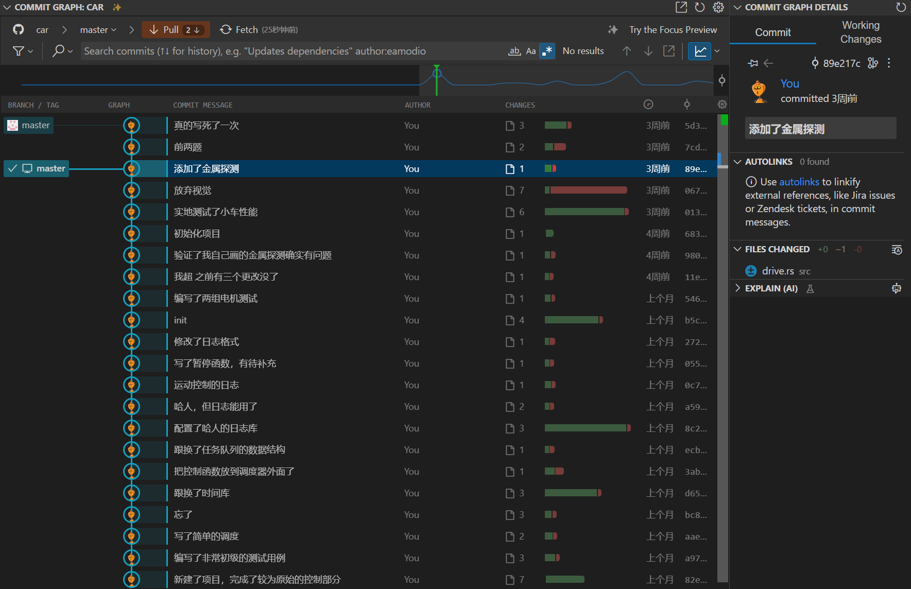

<center><b>图3.1（1） 部分commits</b></center>

代码仓库为：[https://github.com/nan-mu/car](https://github.com/nan-mu/car)


### 单片机控制

`rust`社区设立嵌入式工作组，他们编写了名为《rust嵌入式之书》的教程。该教程没有实体书，但构建了`github-book`，🔗：[https://xxchang.github.io/book/intro/index.html](https://xxchang.github.io/book/intro/index.html) （中文版，由志愿者翻译）下面的报告中我们会尽量避免书中已经提到的部分，专注我们在编程与调试过程中遇到的问题。

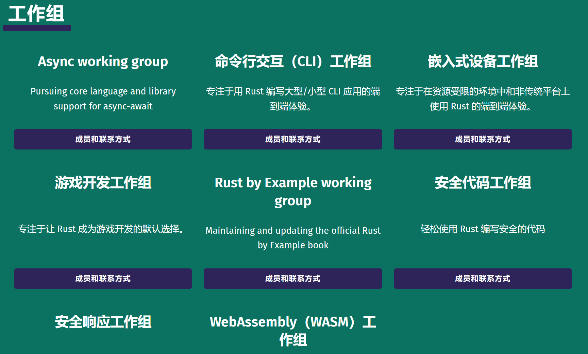

<center><b>图3.2（1） 截自<a href="https://www.rust-lang.org/zh-CN/governance">https://www.rust-lang.org/zh-CN/governance</a></b><center>

#### 与树莓派之间的不同

首先是编译平台的不同，`rust`使用`cargo`作为编译系统（但不止，实际上是`cmake`+`vcpkg`+...），使用`rustup`安装交叉编译工具链。比如我们使用的`stm32f103`，指令集为`ARM Cortex-M3`，对应的`rust`编译目标为`thumbv7m-none-eabi`。而树莓派的指令集为`aarch64`，对应编译目标`aarch64-unknown-linux-musl`。

另一个不同是无法使用`std`标准库，但在开启`rust-analyze`的情况下，会跳出相应的提示提示函数能否使用，所以也不用担心。缺点是一些常用的`vec`和字符串操作是受限使用的。在`std`环境中它们就在`std`下，在`no_std`中它们属于`core::alloc`，即动态内存分配。使用它们我们需要引入第三方库的动态内存分配器。很遗憾，我没有实现这一功能。更多内容见[https://xxchang.github.io/book/intro/no-std.html](https://xxchang.github.io/book/intro/no-std.html)

另一个很大的不同来源于之前提到的`embedded-hal-v0.10.0`，它为引脚控制对象的定义与`rppal`有很大不同，如图：

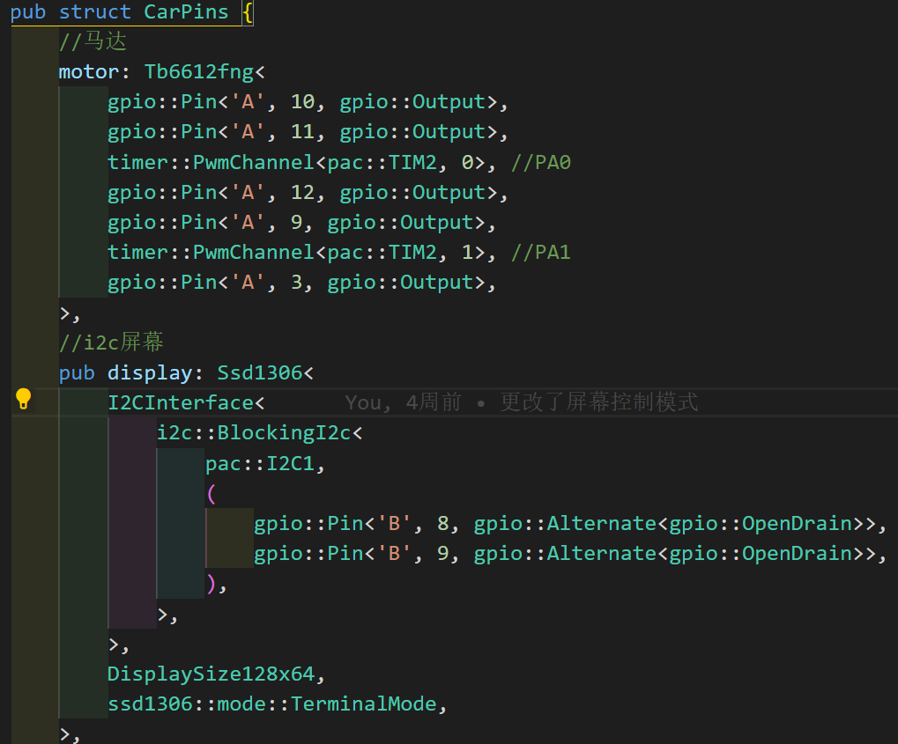

<center><b>图3.2.1（1） 存放引脚的结构体</b></center>

在泛型的位置需要填上具体是哪一个引脚而不是一个输出类型的引脚。当然在编写第三方库时可以使用泛型盖住这里的标志，但这会使我们的结构体的声明变得很长。比如图 中出现了9个引脚，那我们需要11甚至13个泛型类型。

#### 调试

在`rust`中调试可能是编程中最大的难题。在官方教程推荐的方法中，使用`OpenOCD`+`gdb`完成调试。在社区推荐的方法中使用`probe-rs`链接调试器与`cargo`完成调试。前者遇到的问题是我们其实并不会使用`gdb`，撑死记得c，b，q命令是什么意思（甚至我写C语言代码时使用的是`lldb`而且还使用插件完成）。当然最后还是成功了。

第一种方法的具体配置方法需要跟随官方教程走完前两章，这里就不多赘述。后者的配置流程较为简单，在他们的官方`github`中[https://github.com/probe-rs](https://github.com/probe-rs)。我们的开发使用`wsl`，这里介绍一下如何将调试器透过`windows`在`wsl`中使用。

首先需要在windows下安装`usbipd`，在这里它将替代设备管理器并提供将调试器映射到`wsl`的功能。🔗：[https://github.com/dorssel/usbipd-win](https://github.com/dorssel/usbipd-win)。

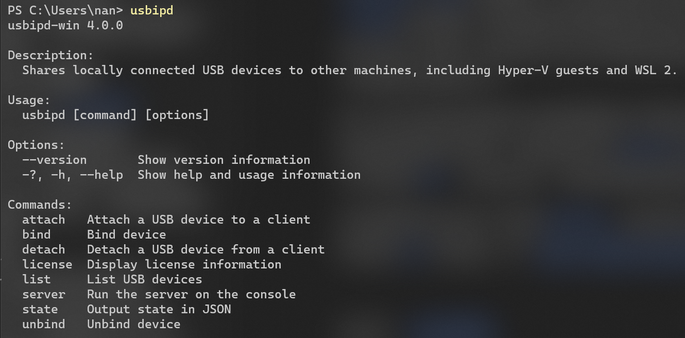

<center>图 usbipd验证usbipd是否安装</center>

其中我们需要关注的命令为`list`：功能如题；`bind`与`unbind`：相当于将设备与`usbipd`绑定以便于设置它。在设备与`usbipd`绑定时并不会消耗它的句柄，其他应用仍可以使用它。`attach`：和调试中的附加很相似，将设备附加到进程，我们需要在`wsl`中使用设备自然就是通过该命令附加到`wsl`中。下面我拿我手上的`PWLINK2`（一个带有很友好的上位机的国产调试器，是`cmsis-DAP`）。

插上设备后运行

```powershell
usbipd list
```

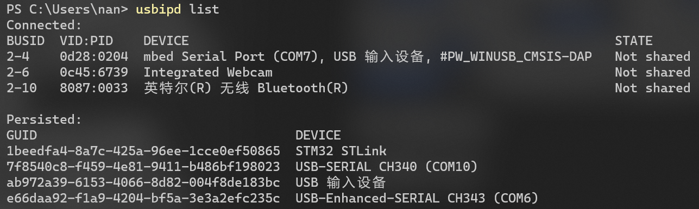

从输出中可以看出我们刚刚插入的设备的总线ID为2-4，在`usbipd`中不使用设备端口（可能也可以）标志设备。从右侧的状态中可以看到`usbipd`未共享该设备，现在绑定它。（需要管理权限，`sudo`命令可以通过`scoop`等`windows`包管理器安装）

```powershell
sudo usbipd bind -b 2-4
```

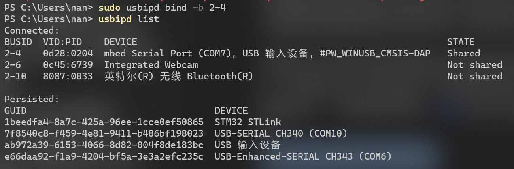

这时`wsl`下找不到设备

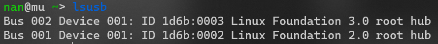

然后使用附加命令，成功时的输出如图：

```powershell
sudo usbipd attach --wsl -b 2-4
```

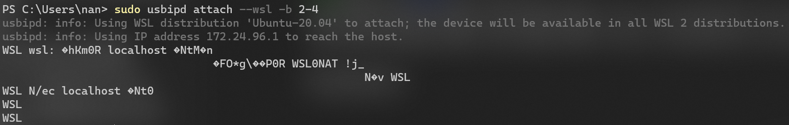

现在我们就可以在`wsl`中使用它了

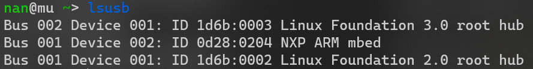

`usbipd`在23年十月6号发布了`v4.0.0`，其中最大的改动就是附加设备到`wsl`的命令，且对于之前版本的命令没有向下兼容。所以在网络上的大部分相关中文教程提供的命令是错误的，甚至官方文档在我们做比赛时也为及时更新。某种意义上来说本报告是现在中文互联网中唯一正确的`usbipd`附加`wsl`教程。


#### `ssd1306`

这部分的重点其实并不是使用屏幕本身，而是使用一些`rust`带来的编程便利与屏幕相结合。我认为这在C语言中是完全无法实现的。在前文3.1.1 `new`中我们提到了`.unwrap()`的作用。现在我将自己实现一个`.unwrap`，区别是一旦读到`Result::Err(T)`，就让报错输出到屏幕上并进入空的死循环。

实现的方法是编写一个`trait`，然后为`core::option::Option`实现它：

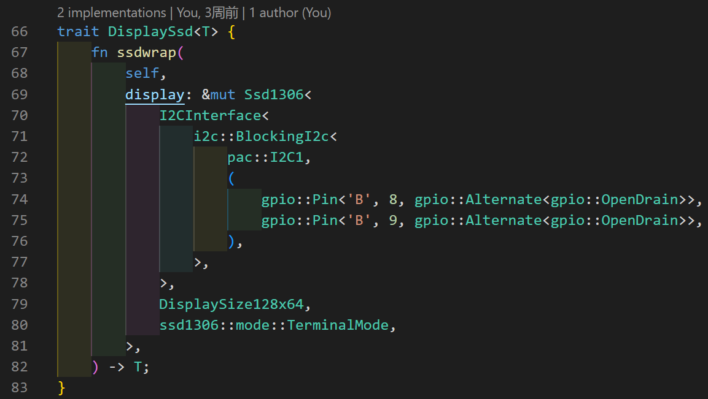

<center><b>图 3.2.3（1）实现该功能的trait</b></center>

具体的实现非常简单，这里去掉了复杂的声明：

```rust
fn ssdwrap() -> () {
        match self {
            Ok(()) => (),
            Err(e) => {
                display.clear().unwrap();
                writeln!(display, "{:?}", e).unwrap();
                ()
            }
        }
    }
```

这里使用`core::fmt::Write`的宏`writeln!`，这很类似C语言中`iostream`的实现。可能细心的读者会注意到在图 的声明中该函数的返回值为泛型，但在这里我们指定了返回类型为空（就是`()`）。这是由于`match`和C语言的`switch`一样需要保证输出类型一致，否则函数将会有两种类型。或者我们可以让他输出一个`Result`或者`Option`，但我当时没想到😅，就为每种类型手动复制粘贴了一个（总共就两个）。可说实话一个需要拆解的枚举在拆解后又返回了一个需要拆解的枚举，这用起来太丑了。有了它后在代码的任何需要拆解`Result`中我们就可以这样写：

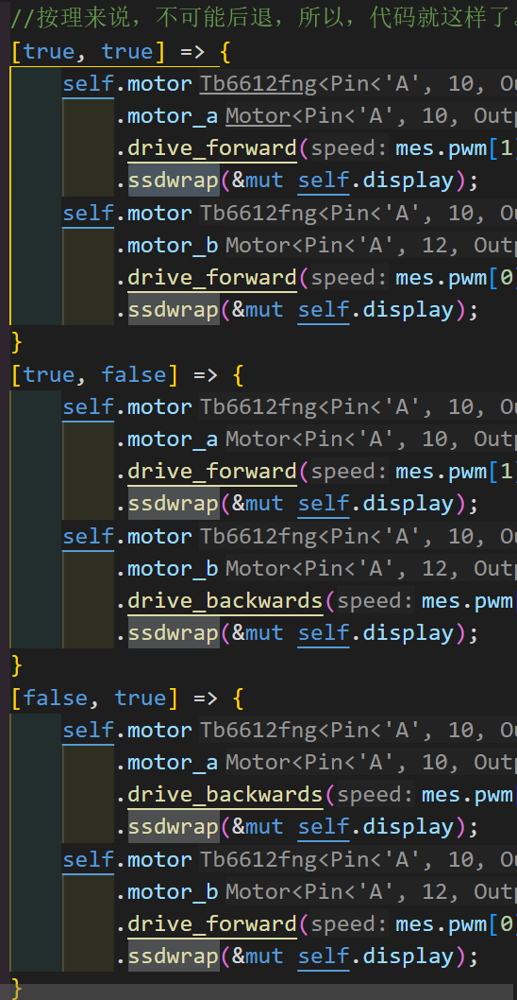

<center><b>图 3.2.3（2） ssdwrap使用样例</b></center>

这也算是一种调试方法。可能使用`keil`等嵌入式集成`IDE`的读者对此会很有疑惑，明明可以使用调试器把错误输出到控制台，为什么需要如此费劲地输出到屏幕中。原因为我们的小车在运行时不会链接电脑，单片机一旦复位就看不到之前报的错了。我看到有的同学在比赛过程中抱着电脑跟着小车走，这非常累。我们的方法就不需要。

#### `HAL`

这部分与比赛的关系不会很大，但有助于帮助读者理解在`rust`下进行嵌入式编程的基本原理。在C语言进行嵌入式编程中，可能很多读者只掌握了使用`Keil`等`IDE`，然后用卖家或者网上找的`HAL`库就开始编程了。好处是很简单，但中间省略了很多知识点。所以本小节我们将以国产单片机`cw32f030`为例，自己编写`HAL`。当然本报告的作者还未正式学习嵌入式知识，中间可能有些纰漏还请谅解。

首先需要确定具体的流程，依托于`rust`嵌入式工作组的工作，我们无需从0开始编写HAL库。嵌入式编程一开始基于C语言开始发展，我们也可以从中分割出一些工作方便我们的编写。比如在使用`Keil`时我们需要将单片机厂家提供的`svd`导入到`Keil`中。`svd`文件中定义了某个芯片的非常详细的信息，包含了哪些片内外设，每一个外设的硬件寄存器，每一个寄存器中每一个数据位的值，以及详细的说明信息等等。

所以开发的第一步就是通过`svd2rust`生成一个类似底层库的`rust`库，生成的库符合`embedded-hal`的要求，该工具由嵌入式工作组的工具团队负责维护，项目🔗：[https://github.com/rust-embedded/svd2rust](https://github.com/rust-embedded/svd2rust)。具体流程在他们编写的文档中已经描述地非常完备，我们直接看看结果：[https://crates.io/crates/cw32f030-hal](https://crates.io/crates/cw32f030-hal)。

> `cw32f030`的`svd`文件已经其余相关资料可以从[https://www.whxy.com/ziliaoxiazai.html](https://www.whxy.com/ziliaoxiazai.html)这里下载，这里展示的`cw32f030-v0.1.1`由本报告作者维护。


在该库的文档中我们已经可以看到很多熟悉的名词

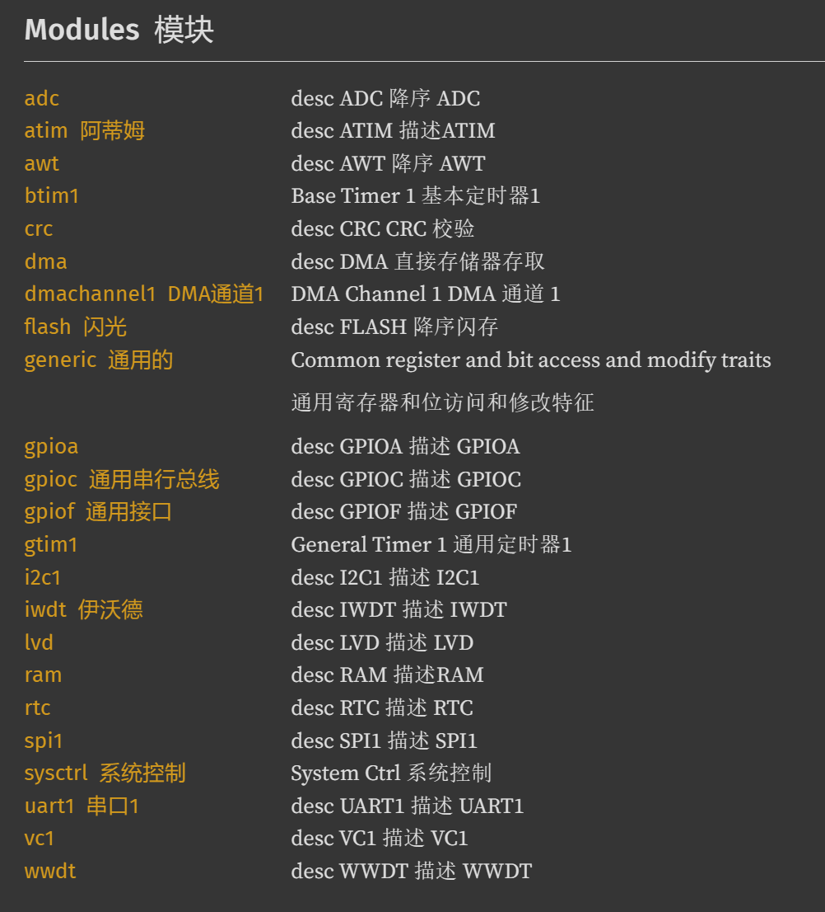

<center>图 截自<a href="https://docs.rs/cw32f030-hal/0.1.1/cw32f030_hal/svd/index.html">https://docs.rs/cw32f030-hal/0.1.1/cw32f030_hal/svd/index.html</a></center>

这里的每个模块提供的作用是暴露出一些函数，这些函数和模块指向的寄存器相关，使用方法如图：

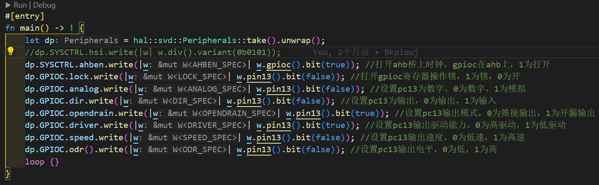

首先我们需要了解第一行的`dp`，指设备外设。所有寄存器的操作对象存在该对象中。需要使用`take`函数取得，该对象的构造是不安全的。其上实现了类似互斥锁的概念保护寄存器操作的原子性。在`dp`下就是各种外设，如图 中所示。比如在第三行中就出现了三层对象，`dp`，`SYSCTRL`，`ahben`。每个对象都对应不同的寄存器区域，每进一层范围都会缩减。往后可以看到这里使用`write`函数实现写操作，但每一层的对象部分对象会实现一个写函数（或者读函数），区别在于，假如`svd`文件没有规定寄存器每一位的作用的话，这个写操作就是`unsafe`的，反正可以直接使用。

> `unsafe`源于`rust`对于内存操作的安全需求。假如程序员完全了解自己正在做的事，但这件事在编译器看来会破环内存安全，那这个操作就是`unsafe`的。写法如下
> 
> ```rust
> unsafe { dp.write(); }
> ```


说回正题，到了最底层的对象，假如文件描述他是可写的，那该对象就会实现`write`函数（读操作也是一样），该函数直接实现在`Reg<T>`对象上，但该对象需要实现`Writable` `trait`。函数签名如下

```rust
pub fn write<F>(&self, f: F)
    where
        F: FnOnce(&mut W<REG>) -> &mut W<REG>,
```

> 这里的`where`语句是一种泛型的简写，用于使函数声明保持美观，以上代码等效于：
>
> ```rust
> pub fn write<F: FnOnce(&mut W<REG>) -> &mut W<REG>>(&self, f: F)
> ```

我们可以发现，该函数的形参是一个泛型，该泛型需要满足`FnOnce(&mut W<REG>) -> &mut W<REG>`这样一个类似函数签名的`trait`。这里我们暂且当作属性需要一个函数即可。在C语言中一般叫做`lambda`函数，在前端中叫做匿名函数。之所以提到前端，是因为这里需要考虑类似前端匿名函数中`this`的问题（得益于所有权`rust`一般不需要考虑浅拷贝深拷贝的问题）。

简单来说，`write`函数的功能其实是暴露出一个写对象，在该对象上调用对应的函数。之前的`dp`之类的对象从寄存器地址上进行划分，这里的写对象则在具体寄存器位上进行划分。这里同样遵从之前关于`unsafe`操作的划分。至此我们就真正的能够操作寄存器了。

以上便是单片机开发的全部内容，具体控制逻辑非常简单。如有疑问欢迎查看代码仓库🔗：[https://github.com/over12345/car.git](https://github.com/over12345/car.git)，以下是部分commits：

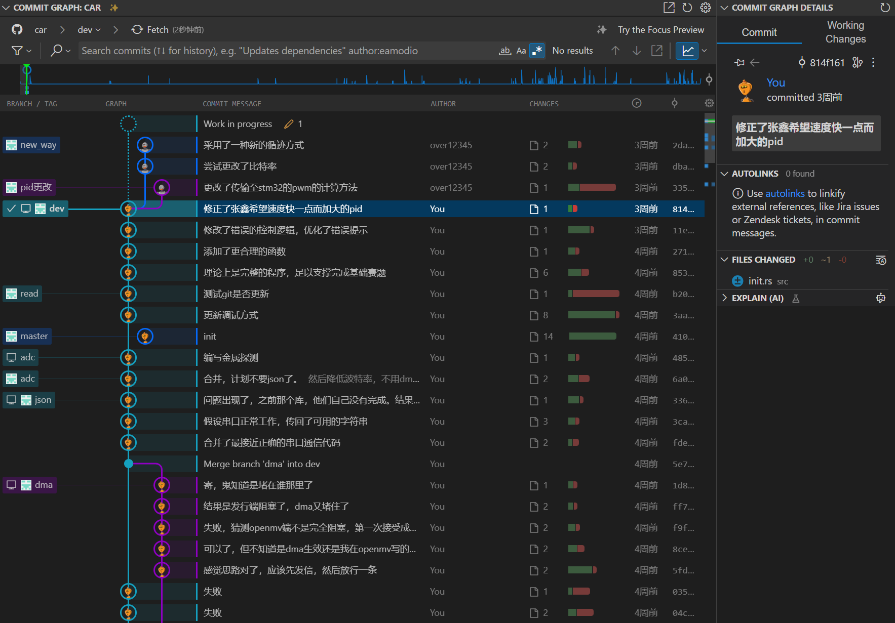

<center><b>图 3.2（2）部分commits</b></center>


