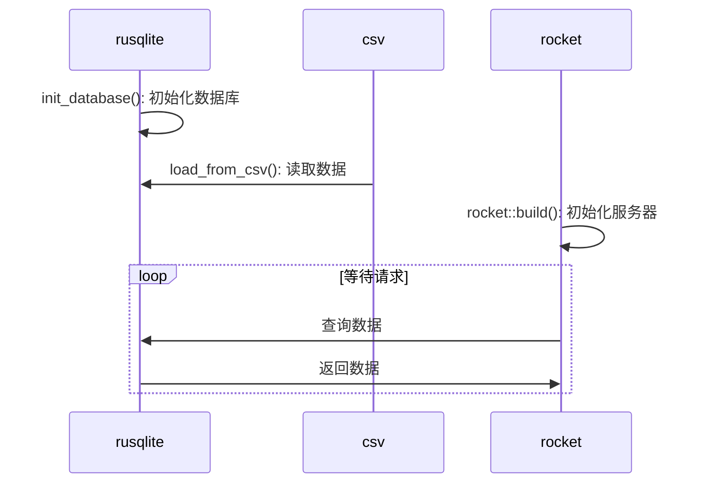

# 数据库大作业

## 需求分析

 我的题目就是单纯把数据读出来然后绘图。然后画图并不是数据库这门课的重点。按照我的想法，最贴近我们这门课的内容就是写一个查询API。那需求就是从读csv文件开始，起一个服务器，作为查询API。

我计划使用rust编程语言，主要使用一下四个库

```toml
csv = "1.3.0" # csv解析库
rocket = "0.5.0" # http服务端库
rusqlite = { version = "0.30.0", features = ["bundled"] } # 内嵌sqlite，作为数据库
time = { version = "0.3", features = ["macros"] } # 时间对象库
```


<center>图1 csv文件开头</center>

查看数据源，可见前4个字段可以作为查询关键字，都是`Text`类型，后面年份为整数，PM数值为浮点数。

## 代码

### 数据类型

首先，处理每一条数据需要囊括csv文件的每一个字段。数据需要能从csv文件中的字符串创建，然后能插入到数据库中，能展示再控制台中。

仔细观察csv文件会发现，有的数据缺少PM2.5或是PM10的数据，所以数据结构需要预留缺省条件；有的数据缺少其中一项年份数据，所以需要设置读取时从另一项的年份作为补充。

囊括缺省情况我通过构建`PmAndYear`枚举，其声明，变体还有顺带实现的`Display`Trait 如下：

```rust
pub enum PmAndYear {
    Pm25(f64, Date),
    Pm10(f64, Date),
    None,
}

impl fmt::Display for PmAndYear {
    fn fmt(&self, f: &mut fmt::Formatter<'_>) -> fmt::Result {
        match self {
            PmAndYear::None => write!(f, "缺省数据"),
            PmAndYear::Pm25(pm, year) => write!(f, "pm2.5: {}, year: {}", pm, year.year()),
            PmAndYear::Pm10(pm, year) => write!(f, "pm10 : {}, year: {}", pm, year.year()),
        }
    }
}
```

然后是主要的结构体`Item`，下面是它的声明，构造函数，`Display`Trait：

```rust
pub struct Item {
    region: String,
    subregion: String,
    country: String,
    city: String,
    pm10: PmAndYear,
    pm25: PmAndYear,
}

impl fmt::Display for Item {
    fn fmt(&self, f: &mut fmt::Formatter<'_>) -> fmt::Result {
        write!(
            f,
            "<region {}> <subregion {}> <country {}> <city > {} | {} {}",
            self.region, self.subregion, self.country, self.city, self.pm10, self.pm25,
        )
    }
}

pub trait Build {
    fn new(
        region: &str,
        subregion: &str,
        country: &str,
        city: &str,
        pm10: PmAndYear,
        pm25: PmAndYear,
    ) -> Self;
}

impl Build for Item {
    fn new(
        region: &str,
        subregion: &str,
        country: &str,
        city: &str,
        pm10: PmAndYear,
        pm25: PmAndYear,
    ) -> Item {
        Item {
            region: region.to_string(),
            subregion: subregion.to_string(),
            country: country.to_string(),
            city: city.to_string(),
            pm10,
            pm25,
        }
    }
}
```

这是数据类型的声明和部分功能的实现部分。有了`Display`Trait在调试时就可以直接输出不需要就地转换字符串。主要也可以兼容迭代器。

### 主要逻辑

主要逻辑如图：



代码主要分为三个模块：

* main：根模块，包含服务器和总的业务逻辑
* db_option：主要包含数据处理的部分
* tests：单元测试模块

### db_option.rs

#### `db_option::pub fn init_database() -> Result<()>`

为了方便调试，每次程序启动都会删除预定路径上的数据库文件重新从csv文件构建。同时创建表也在该函数中：

```rust
pub fn init_database() -> Result<()> {
    //假如数据库文件存在，则删除。
    let db_path = Path::new("air_quality.db");
    if db_path.exists() {
        fs::remove_file(db_path).unwrap();
    }
    let conn = Connection::open(db_path).unwrap();
    conn.execute(
        "CREATE TABLE IF NOT EXISTS air_quality (
             id INTEGER PRIMARY KEY,
             region TEXT NOT NULL,
             subregion TEXT NOT NULL,
             country TEXT NOT NULL,
             city TEXT NOT NULL,
             pm10 REAL,
             pm10_year INTEGER,
             pm25 REAL,
             pm25_year INTEGER 
         )",
        [],
    )
    .unwrap();
    Ok(())
}
```

#### `db_option::pub fn load_from_csv() -> Result<()>`

这位是重量级，如前文数据结构提到，csv中的数据可以说是非常脏，所以业务逻辑会稍显复杂：

```rust
pub fn load_from_csv() -> Result<()> {
    let conn = Connection::open("air_quality.db").expect("Could not open database");
    let csv_path = Path::new("res/9.world_pm25_pm10.csv");
    let file = fs::File::open(csv_path).unwrap();
    let mut rdr = csv::ReaderBuilder::new()
        .flexible(true)
        .double_quote(false)
        .from_reader(file);
    for result in rdr.records() {
        let record = result.unwrap();
        println!("{:?}", record); //for debug
        let item = Item::new(
            record.get(0).ok_or("Missing region").unwrap(),
            match record.get(1) {
                Some(mes) => mes,
                None => {
                    println!("问题数据：{:?}", record);
                    "寄"
                }
            },
            match record.get(2) {
                Some(mes) => mes,
                None => {
                    println!("问题数据：{:?}", record);
                    "寄"
                }
            },
            record.get(3).ok_or("Missing city").unwrap(),
            match record.get(4).unwrap().parse() {
                Ok(num) => PmAndYear::Pm10(
                    num,
                    Date::from_ordinal_date(
                        match record.get(5).unwrap().parse() {
                            Ok(year) => year,
                            Err(_) => record.get(7).unwrap().parse().unwrap(),
                        },
                        1,
                    )
                    .unwrap(),
                ),
                Err(e) => {
                    println!("问题数据：{:?}；可能缺少pm2.5", record);
                    println!("{:?}", e);
                    PmAndYear::None
                }
            },
            match record.get(6).unwrap().parse() {
                Ok(num) => PmAndYear::Pm25(
                    num,
                    Date::from_ordinal_date(
                        match record.get(7).unwrap().parse() {
                            Ok(year) => year,
                            Err(_) => record.get(5).unwrap().parse().unwrap(),
                        },
                        1,
                    )
                    .unwrap(),
                ),
                Err(e) => {
                    println!("问题数据：{:?}；可能缺少pm2.5", record);
                    println!("{:?}", e);
                    PmAndYear::None
                }
            },
        );
        insert_item(&conn, &item).unwrap();
    }

    Ok(())
}
```

#### `db_option::pub fn insert_item(conn: &Connection, item: &Item) -> Result<()>`

如题，从结构体`Item`插入到数据库。主要逻辑是从`PmAndYear`枚举穷尽每种可能情况以插入正确的数据：

```rust
pub fn insert_item(conn: &Connection, item: &Item) -> Result<()> {
    conn.execute(
        "INSERT INTO air_quality (region, subregion, country, city, pm10, pm10_year, pm25, pm25_year)
         VALUES (:region, :subregion, :country, :city, :pm10, :pm10_year, :pm25, :pm25_year)",
         &[
            &item.region.to_string() as &dyn types::ToSql,
            &item.subregion.to_string() as &dyn types::ToSql,
            &item.country.to_string() as &dyn types::ToSql,
            &item.city.to_string() as &dyn types::ToSql,
            &match item.pm10 {
                PmAndYear::Pm10(pm, _) => Option::Some(pm),
                _ => Option::None,
            } as &dyn types::ToSql,
            &match item.pm10 {
                PmAndYear::Pm10(_, year) => Option::Some(year.year()),
                _ => Option::None,
            } as &dyn types::ToSql,
            &match item.pm25 {
                PmAndYear::Pm25(pm, _) => Option::Some(pm),
                _ => Option::None,
            } as &dyn types::ToSql,
            &match item.pm25 {
                PmAndYear::Pm25(_, year) => Option::Some(year.year()),
                _ => Option::None,
            } as &dyn types::ToSql,
        ]
    )?;

    Ok(())
}
```

最开始时我是希望为`Item`实现`rusqlite`中声明的`Parms`Trait，但首先他的内置函数还是实验性的，而后他们把所有参数类型的转化都使用`ToSql`Trait转化。所以主要的逻辑是由`ToSql`实现，但类型检查却由`Parms`来检查。可见确实非常实验性——通过一个无法实现的Trait来防止用户编写不安全的Trait。但也并非完全堵死，官方也推荐将所有具有迭代器Trait的类型作为参数。可我最初设计`Item`时字符串部分偷懒没用`String`而是使用字符串切片，结果反而弄巧成拙，引入了维护成本巨大的引用声明周期问题，导致几乎不可能实现导出借用的迭代器（网上几乎没有资料，包括国外论坛，他们使用一个包引入一个宏来一键为结构体创建迭代器，很方便，但该宏没有兼容生命周期的写法）。

### main.rs

这部分相比起处理复杂的数据结构来说就相对简单，其实按照工程上的习惯来讲，应该首先启动服务器再去连接数据库。但这就设计到中间件和整流罩（嘶，英文我忘记了，似乎是`rocket`独创，类似`Qt`的信号槽的东西）的设计。这就麻烦过头了，所以我将数据库部分的逻辑拆分，分为创建和使用两部分，这样只需要把使用（即查询功能）写在响应体的回调函数当中即可。然后这部分的完整代码如下：

```rust
#[get("/query?<id>&<region>&<subregion>&<country>&<city>")]
fn query(
    id: Option<i64>,
    region: Option<&str>,
    subregion: Option<&str>,
    country: Option<&str>,
    city: Option<&str>,
) -> String {
    let conn = Connection::open("air_quality.db").expect("Could not open database");
    let mut query = "select * from air_quality where 1 = 1".to_string();

    if let Some(id_) = id {
        query.push_str(&(format!(" and id = {}", id_)));
    }
    if let Some(region_) = region {
        query.push_str(&(format!(" and region = {}", region_)));
    }
    if let Some(subregion_) = subregion {
        query.push_str(&(format!(" and subregion = {}", subregion_)));
    }
    if let Some(country_) = country {
        query.push_str(&(format!(" and country = {}", country_)));
    }
    if let Some(city_) = city {
        query.push_str(&(format!(" and city = {}", city_)));
    }
    query.push_str(";");

    let mut stmt = conn.prepare(&query).unwrap();
    let item_iter = stmt
        .query_map([], |row| {
            println!("{:?}", row);
            Ok(Item::new(
                &(row.get::<usize, String>(1).unwrap()),
                &(row.get::<usize, String>(2).unwrap()),
                &(row.get::<usize, String>(3).unwrap()),
                &(row.get::<usize, String>(4).unwrap()),
                match row.get::<usize, f64>(5) {
                    Ok(num) => PmAndYear::Pm10(
                        num,
                        Date::from_ordinal_date(
                            match row.get::<usize, i64>(6) {
                                Ok(year) => year as i32,
                                Err(_) => row.get::<usize, i64>(8).unwrap() as i32,
                            },
                            1,
                        )
                        .unwrap(),
                    ),
                    Err(e) => {
                        println!("问题数据：{:?}；可能缺少pm2.5", row);
                        println!("{:?}", e);
                        PmAndYear::None
                    }
                },
                match row.get::<usize, f64>(7) {
                    Ok(num) => PmAndYear::Pm10(
                        num,
                        Date::from_ordinal_date(
                            match row.get::<usize, i64>(8) {
                                Ok(year) => year as i32,
                                Err(_) => row.get::<usize, i64>(6).unwrap() as i32,
                            },
                            1,
                        )
                        .unwrap(),
                    ),
                    Err(e) => {
                        println!("问题数据：{:?}；可能缺少pm10", row);
                        println!("{:?}", e);
                        PmAndYear::None
                    }
                },
            ))
        })
        .unwrap();
    let result: String = item_iter
        .map(|s| s.unwrap().to_string())
        .collect::<Vec<String>>()
        .join("\n");
    result
}

#[main]
async fn main() -> Result<(), Error> {
    //初始化数据库
    init_database().unwrap();
    load_from_csv().unwrap();

    //启动服务器
    let _rocket = rocket::build().mount("/", routes![query]).launch().await?;

    Ok(())
}
```

可以看到使用`rocket`的优势就是有非常人体工学的宏可以使用，不必像传统后端语言那样大费周章地构建路由逻辑。

这里我主要使用`GET`读取查询条件，因为似乎`rocket`读取类似`POST`请求体的话需要显式地编写一个结构体然后放到一个宏当中来读取参数。确实，要是表单一多那这种方法确实方便地不得了。但我懒得写了，直接一个一个读`GET`参数了事。

### tests.rs

最后是测试单元，假如老师有兴趣想看看我的代码的话从测试单元来开始，运行单个函数看看效果非常方便。这也是我第一次使用测试单元，非常丝滑，要不是它我可能没法发现我写的`SQL`语句缺了一个分号。

```rust
use std::fmt::Error;

#[test]
fn test_db_init() -> Result<(), Error> {
    use crate::db_option::{init_database, insert_item, Build, Item, PmAndYear};
    use rusqlite::Connection;
    use time::Date;
    init_database().unwrap();

    let conn = Connection::open("air_quality.db").expect("Could not open database");

    let sample_item = Item::new(
        "Sample Region",
        "Sample Subregion",
        "Sample Country",
        "Sample City",
        PmAndYear::Pm10(25.5, Date::from_ordinal_date(2023, 1).unwrap()),
        PmAndYear::Pm25(15.3, Date::from_ordinal_date(2023, 1).unwrap()),
    );

    match insert_item(&conn, &sample_item) {
        Ok(()) => println!("Item inserted successfully"),
        Err(err) => eprintln!("Error inserting item: {}", err),
    };
    Ok(())
}

#[test]
fn test_load_csv() {
    use crate::db_option::{init_database, load_from_csv};
    init_database().unwrap();
    load_from_csv().unwrap();
}

#[test]
fn test_query() {
    use crate::db_option::{Build, Item, PmAndYear};
    use rusqlite::Connection;
    use time::Date;
    let conn = Connection::open("air_quality.db").expect("Could not open database");
    let query = "select * from air_quality where 1=1 and id=1;".to_string();
    let mut stmt = conn.prepare(&query).unwrap();
    let item_iter = stmt
        .query_map([], |row| {
            println!("{:?}", row);
            Ok(Item::new(
                &(row.get::<usize, String>(1).unwrap()),
                &(row.get::<usize, String>(2).unwrap()),
                &(row.get::<usize, String>(3).unwrap()),
                &(row.get::<usize, String>(4).unwrap()),
                match row.get::<usize, f64>(5) {
                    Ok(num) => PmAndYear::Pm10(
                        num,
                        Date::from_ordinal_date(
                            match row.get::<usize, i64>(6) {
                                Ok(year) => year as i32,
                                Err(_) => row.get::<usize, i64>(8).unwrap() as i32,
                            },
                            1,
                        )
                        .unwrap(),
                    ),
                    Err(e) => {
                        println!("问题数据：{:?}；可能缺少pm2.5", row);
                        println!("{:?}", e);
                        PmAndYear::None
                    }
                },
                match row.get::<usize, f64>(7) {
                    Ok(num) => PmAndYear::Pm10(
                        num,
                        Date::from_ordinal_date(
                            match row.get::<usize, i64>(8) {
                                Ok(year) => year as i32,
                                Err(_) => row.get::<usize, i64>(6).unwrap() as i32,
                            },
                            1,
                        )
                        .unwrap(),
                    ),
                    Err(e) => {
                        println!("问题数据：{:?}；可能缺少pm10", row);
                        println!("{:?}", e);
                        PmAndYear::None
                    }
                },
            ))
        })
        .unwrap();
    let result: String = item_iter
        .map(|s| s.unwrap().to_string())
        .collect::<Vec<String>>()
        .join("\n");
    println!("{}", &result);
}

```

## 效果展示

我觉得最好的方式还是录屏，烦请移步`效果展示.mp4`

**作业代码最终已上传`github`，有完整的编写记录以证明没有抄袭（rust到底还是资料太少了）**

[nan-mu/rust-sql(github.com) https://github.com/nan-mu/rust-sql](https://github.com/nan-mu/rust-sql)
