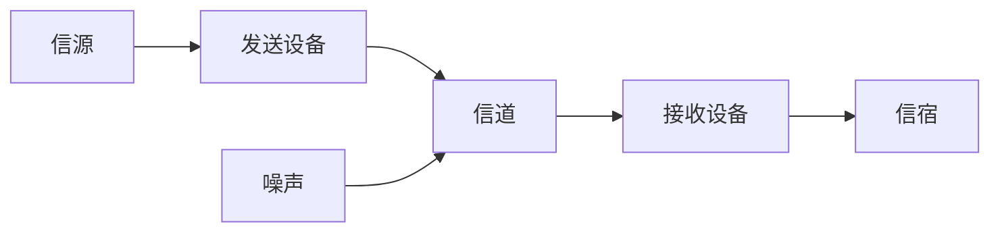
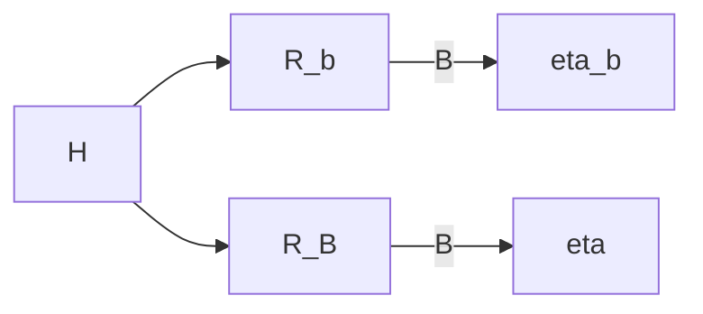

## 通信系统的组成

通信系统包括了信号的产生、发送、传输、接收和恢复等过程所需的一切技术设备。这里的技术设备具体包括：

发送设备会对信号进行**编码**和**调制**。与之对应的接收设备会进行**解调**和**译码**。

## 信息的度量

### 信息量

信息量就是不确定性的多少。不确定性就是概率（可能性）。所以信息量 $I$ 是概率 $P(x)$ 的函数： $I=f[P(x)]$：
$$
I=\log_a\frac1{P(x)}=-\log_aP(x)
$$
一般，$a$ 取$e$，$10$，$2$。他的单位是比特（b）。

### 信源熵

信源熵是信源中每个符号的平均信息量。他描述了信源的平均不确定度即每个符号概率加权的信息量：
$$
H=\sum^M_{i=1}P(x_i)\log_a\frac1{P(x_i)}
$$
单位是b/符号（b/symbol）。根据公式可以得到，每个符号等概时，熵最大，等于每一个符号的信息量。

假设我们需要计算一条消息的总信息量，可以按照以下方法：

$$
已知熵H，信号个数n\\
I_总=n\times H
$$

## 有效性和可靠性

不同系统有不同的衡量有效性的方式

|        | 模拟通信   | 数字通信             |
| ------ | ---------- | -------------------- |
| 有效性 | 传输带宽   | 传输速率、频带利用率 |
| 可靠性 | 输出信噪比 | 差错概率             |

### 数字通信-有效性

使用码元传输速率衡量有效性 $R_B$。表示美妙发送的码元（符号）个数，也称为波特率，单位是波特（Baud）。和赫兹的量纲相同。

结合信息量，使用信息传输速率 $R_b$ 衡量有效性。他是每秒发送的信息量（比特数），也成为**比特率**，传信率，单位是比特每秒（bit/s、b/s、bps）：
$$
R_b=R_B\times H\\
R_b=R_B\times\log_2M\,\,\,\,\,\,\,(等概时)\\
其中\left\{
\begin{array}l
M=2&R_b=R_B\\
M>2&R_b>R_B
\end{array}
\right.
$$
要计算一个系统在带宽上的有效性，还需要使用频带利用率。他表示单位带宽内的传输速率：
$$
\eta=\frac{R_B}{B}\,\,\,\,(\text{Baud/Hz})\\
\eta_b=\frac{R_b}{B}\,\,\,\,(\text{bps/Hz})\\
$$

> 假设A系统比特率为2kbps，占用带宽为2kHz。B系统比特率为1.5kbps，占用带宽为1kHz。
>
> 那么根据频带利用率，后者的有效性更好。根据传输速率，前者的有效性更好。

### 思考题

> 1. 波特率和哪些参数有关？比特率呢？
>
> 2. 数字信号的传输带宽是取决于波特率还是比特率？

gpt回答：

波特率（Baud rate）和比特率（Bit rate）是两个在通信中常见的术语，它们都涉及到数据传输的速度，但它们的定义和关系稍有不同。

#### 波特率（Baud rate）
波特率是指信号变化的速率，即每秒钟信号的变化次数。每一个波特（Baud）代表一个信号变化。如果一个信号变化代表一个比特（bit），那么波特率和比特率是相同的。

波特率的大小与以下参数有关：
1. **信号的调制方式**：不同的调制方式（如幅度调制、频率调制、相位调制等）可以在同一个波特上编码不同数量的比特。
2. **通道带宽**：通道的带宽限制了可以实现的最大波特率。
3. **信号噪声和干扰**：信号的质量影响可以支持的波特率。
4. **符号编码**：在复杂的编码方案中，一个波特可能代表多个比特（例如QAM调制中）。

#### 比特率（Bit rate）
比特率是指每秒钟传输的比特数，它直接表示数据传输的速率。比特率是实际传输的数据量的量度。

比特率的大小与以下参数有关：
1. **波特率**：比特率通常是波特率的一个倍数，具体取决于调制方案。例如，在每个波特上使用2个比特的QPSK调制下，比特率是波特率的两倍。
2. **调制方式**：高级的调制方式（如16-QAM、64-QAM）可以在每个符号中传输更多的比特，从而增加比特率。
3. **编码方式**：数据的编码方案（如前向纠错编码）可能会增加实际传输的比特量，从而影响比特率。

#### 关系总结
- **波特率（Baud rate）**：每秒钟信号变化的次数。
- **比特率（Bit rate）**：每秒钟传输的比特数。

在简单的情况下，如果每个波特仅代表一个比特，那么波特率和比特率是相同的。但在更复杂的调制和编码情况下，比特率可能是波特率的一个倍数。

### 数字通信-可靠性

和模拟通信的信噪比一样，数字通信使用误码率和误信率衡量可靠性：
$$
\begin{array}l
误码率&P_e=\frac{错误码元数}{传输码元总数}=\frac{N_e}N\\
误信率（误比特率）&P_b=\frac{错误比特数}{传输总比特数}=\frac{I_e}I\\
\end{array}
$$

> 注意二进制下两者相同，M进制下误信率小于等于误码率

> 例题：**2进制**数字传输系统，码长为**0.1ms**，各码元**等概独立**出现，连续工作**30分钟**后，接收端收到**18个错码**，且每个错误码元中仅发生**1bit**的错误。试求：
>
> 1. $R_B$，$R$。$I_总$，$P_e$，$P_b$。
> 2. 若改为四进制，其他条件不变，又如何？

$$
根据题目得到\,\,\,\,T_B=10^{-1}s\,\,\,\,t=1800s\,\,\,\,N_e=1\,\,\,\,I_e=1b\\
\therefore\left\{
\begin{array}l
R_B=\frac1{T_B}=10^4(\text{Baud})\\
R_b=R_B\times\log_2M=10^4(\text{bps})
\end{array}\right.\\
\therefore\left\{
\begin{array}l
I_总=R_b\times t=18\times10^6(\text{b})\\
N=R_B\times t=18\times10^6\\
\end{array}\right.\\
\therefore\left\{
\begin{array}l
P_e=\frac{N_e}N=10^{-6}\\
P_b=\frac{I_e}I=10^{-6}
\end{array}\right.
$$

